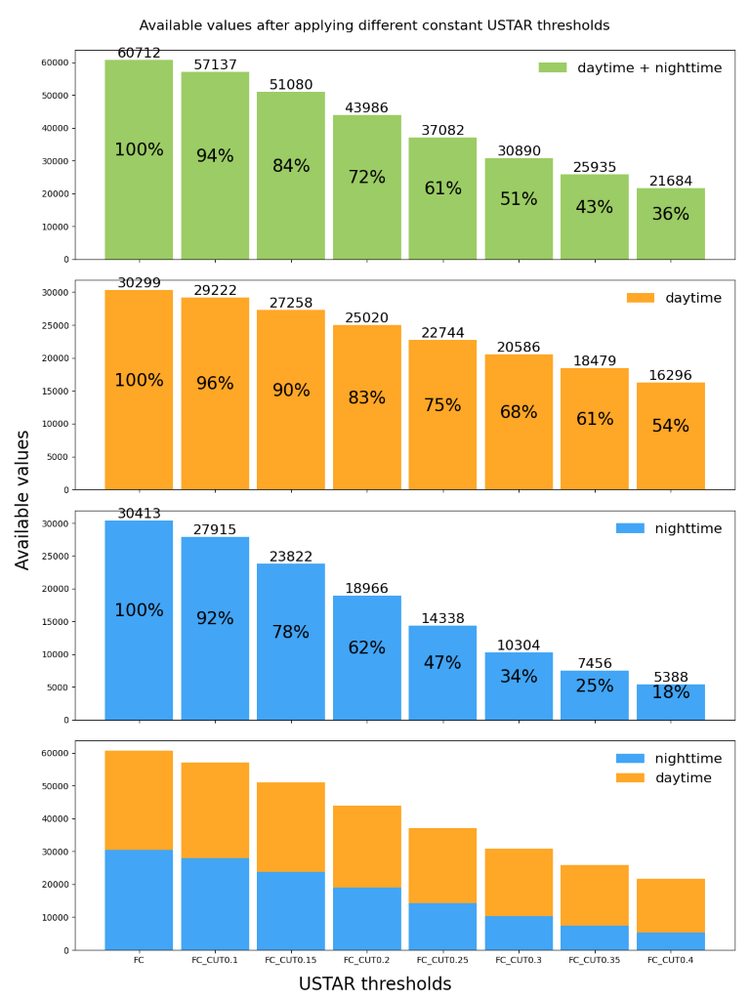
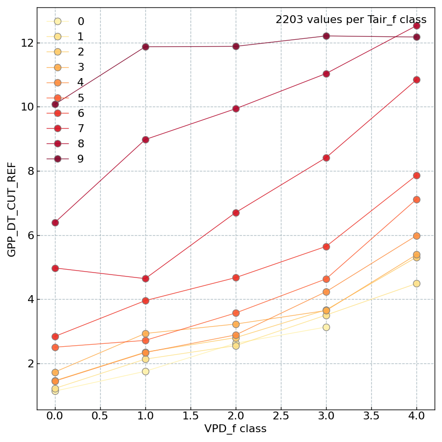
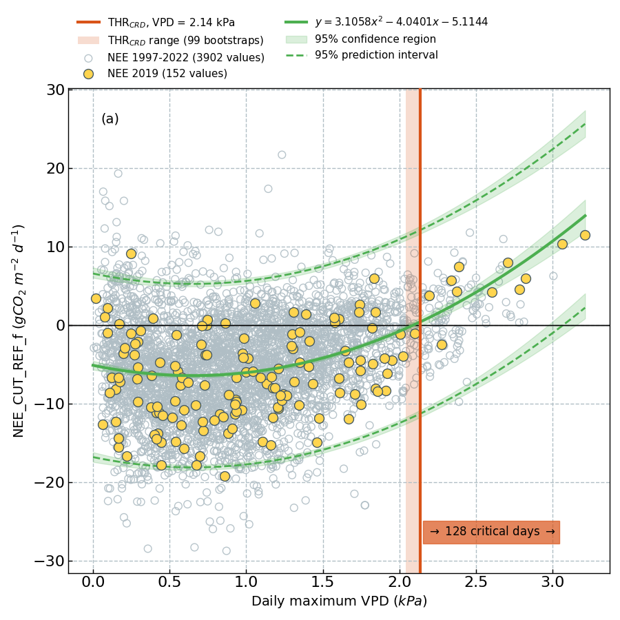
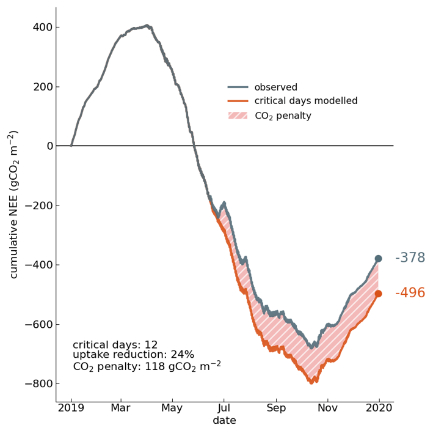
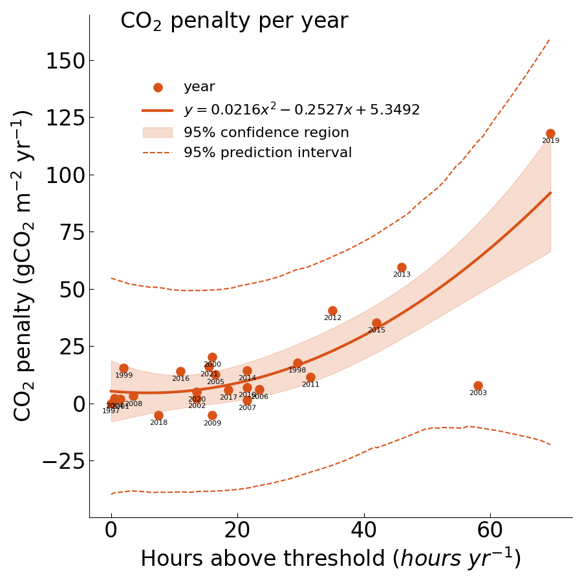
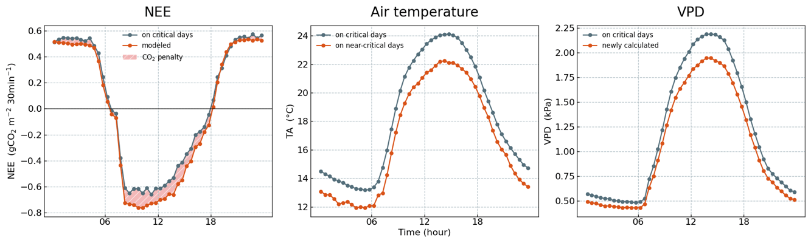
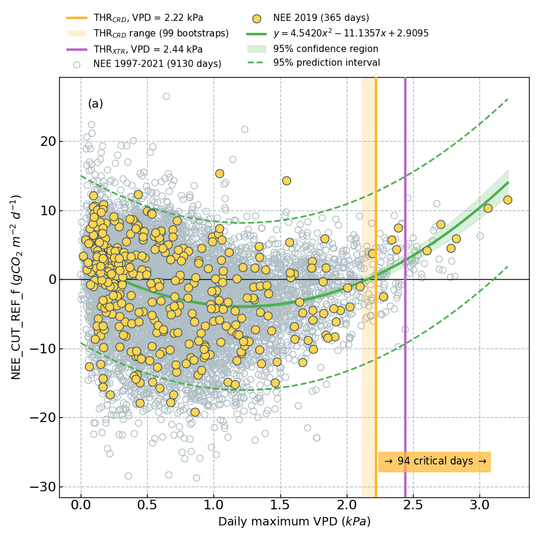
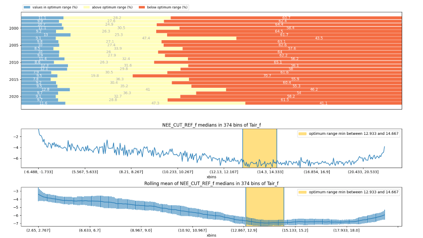
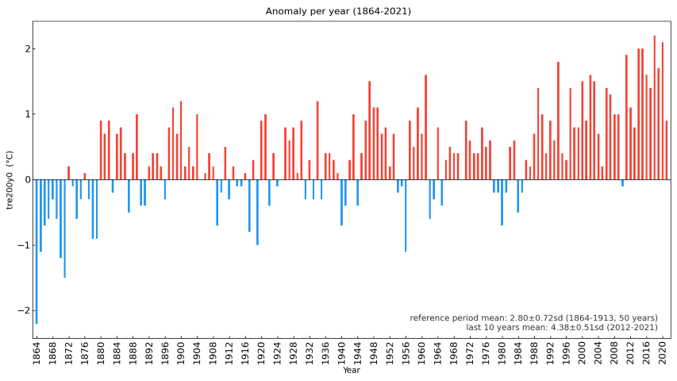

# Changelog

## v0.XX.0 | XX Apr 2023
INDEV
XXX

- (`pkgs.analyses.gapfinder.GapFinder`)

### Notebooks

- Added new notebook for **finding gaps in time series** in `notebooks/Analyses/GapFinder.ipynb` 
- Added new notebook for **time functions** in `notebooks/TimeFunctions/times.ipynb` 
 

## v0.53.0 | 17 Apr 2023

This update focuses on wind direction time series and adds the first example notebooks
to `diive`. From now on, new example notebooks will be added regularly.

### New features

- **Wind direction offset correction**: Compare yearly wind direction histograms to
  reference, detect offset in comparison to reference and correct wind directions
  for offset per year (`pkgs.corrections.winddiroffset.WindDirOffset`)
- **Wind direction aggregation**: Calculate mean etc. of wind direction in
  degrees (`core.funcs.funcs.winddirection_agg_kanda`)

### Notebooks

- Added new notebook for **wind direction offset correction** in `notebooks/Corrections/WindDirectionOffset.ipynb`
- Added new notebok for **reading ICOS BM files** in `notebooks/ReadFiles/Read_data_from_ICOS_BM_files.ipynb`

### Changes

- **Histogram analysis** now accepts pandas Series as input (`pkgs.analyses.histogram.Histogram`)

### Additions

- Added unittests for reading (some) filetypes

## v0.52.7 | 16 Mar 2023

### Additions

- The DataFileReader can now directly read zipped files (`core.io.filereader.DataFileReader`)
- **Interactive time series plot**: (`core.plotting.timeseries.TimeSeries.plot_interactive`)
    - added x- and y-axis to the plots
    - new parameters `width` and `height` allow to control the size of the plot
    - more controls such as undo/redo and zoom in/zoom out buttons were added
- The filetypes defined in `diive/configs/filetypes` now accept the setting `COMPRESSION: "zip"`.
  In essence, this allows to read zipped files directly.
- New filetype `ICOS_H2R_CSVZIP_10S`

### Changes

- Compression in filetypes is now given as `COMPRESSION: "None"` for no compression,
  and `COMPRESSION: "zip"` for zipped CSV files.

## v0.52.6 | 12 Mar 2023

### Additions

- `LocalSD` in `StepwiseMeteoScreeningDb` now accepts the parameter `winsize` to
  define the size of the rolling window (default `None`, in which case the window
  size is calculated automatically as 1/20 of the number of records).
  (`pkgs.qaqc.meteoscreening.StepwiseMeteoScreeningDb.flag_outliers_localsd_test`)

### Bugfix

- Fixed bug: outlier test `LocalSD` did not consider user input `n_sd`
  (`pkgs.qaqc.meteoscreening.StepwiseMeteoScreeningDb.flag_outliers_localsd_test`)

## v0.52.4 and v0.52.5 | 10 Mar 2023

### Bugfix

- Fixed bug: during resampling, the info for the tag `data_version` was incorrectly
  stored in tag `freq`. (`pkgs.qaqc.meteoscreening.StepwiseMeteoScreeningDb.resample`)

## v0.52.3 | 10 Mar 2023

## Additions

- Added plotting library `bokeh` to dependencies

### Changes

- When combining data of different time resolutions, the data are now combined using
  `.combine_first()` instead of `.concat()` to avoid duplicates during merging. This
  should work reliably because data of the highest resolution are available first, and then
  lower resolution upsampled (backfilled) data are added, filling gaps in the high
  resolution data. Because gaps are filled, overlaps between the two resolutions are avoided.
  With `.concat()`, gaps were not filled, but timestamps were simply added as new records,
  and thus duplicates in the timestamp occurred.
  (`pkgs.qaqc.meteoscreening.StepwiseMeteoScreeningDb._harmonize_timeresolution`)
- Updated dependencies to newest possible versions

## v0.52.2 | 9 Mar 2023

### Changes

- Removed the packages `jupyterlab` and `jupyter-bokeh` from dependencies, because
  the latter caused issues when trying to install `diive` in a `conda` environment
  on a shared machine. Both dependencies are still listed in the `pyproject.toml`
  file as `dev` dependencies. It makes sense to keep both packages separate from
  `diive` because they are specifically for `jupyter` notebooks and not strictly
  related to `diive` functionality.

## v0.52.1 | 7 Mar 2023

### Additions

- In `StepwiseMeteoScreeningDb` the current cleaned timeseries can now be
  plotted with `showplot_current_cleaned`.
- Timeseries can now be plotted using the `bokeh` library. This plot are interactive
  and can be directly used in jupyter notebooks. (`core.plotting.timeseries.TimeSeries`)
- Added new plotting package `jupyter_bokeh` for interactive plotting in Jupyter lab.
- Added new plotting package `seaborn`.

### Bugfixes

- `StepwiseMeteoScreeningDb` now works on a copy of the input data to avoid
  unintended data overwrite of input.

## v0.52.0 | 6 Mar 2023

### New Features

- **Data formats**: Added new package `diive/pkgs/formats` that assists in converting
  data outputs to formats required e.g. for data sharing with FLUXNET.
    - Convert the EddyPro `_fluxnet_` output file to the FLUXNET data format for
      data upload (data sharing). (`pkgs.formats.fluxnet.ConvertEddyProFluxnetFileForUpload`)
- **Insert timestamp column**: Insert timestamp column that shows the START, END
  or MIDDLE time of the averaging interval (`core.times.times.insert_timestamp`)
- **Manual removal of data points**: Flag manually defined data points as outliers.
  (`pkgs.outlierdetection.manualremoval.ManualRemoval`)

### Additions

Added additional outlier detection algorithms
to `StepwiseMeteoScreeningDb` (`pkgs.qaqc.meteoscreening.StepwiseMeteoScreeningDb`):

- Added local outlier factor test, across all data
  (`pkgs.qaqc.meteoscreening.StepwiseMeteoScreeningDb.flag_outliers_lof_test`)
- Added local outlier factor test, separately for daytime and nighttime
  (`pkgs.qaqc.meteoscreening.StepwiseMeteoScreeningDb.flag_outliers_lof_dtnt_test`)

## v0.51.0 | 3 Mar 2023

### Random uncertainty

- Implemented random flux uncertainty calculation, based on Holliner and Richardson (2005)
  and Pastorello et al. (2020). Calculations also include a first estimate of the error
  propagation when summing up flux values to annual sums. See end of CHANGELOG for links to references.
  (`pkgs.flux.uncertainty.RandomUncertaintyPAS20`)

### Additions

- Added example data in `diive/configs/exampledata`, including functions to load the data.

### Changes

- In `core.io.filereader`, the following classes now also accept `output_middle_timestamp`
  (boolean with default `True`) as parameter: `MultiDataFileReader`, `ReadFileType`,`DataFileReader`.
  This allows to keep the original timestamp of the data.
- Some minor plotting adjustments

## v0.50.0 | 12 Feb 2023

### StepwiseMeteoScreeningDb

**Stepwise quality-screening of meteorological data, directly from the database**

In this update, the stepwise meteoscreening directly from the database introduced in the
previous update was further refined and extended, with additional outlier tests and corrections
implemented. The stepwise meteoscreening allows to perform step-by-step quality tests on
meteorological. A preview plot after running a test is shown and the user can decide if
results are satisfactory or if the same test with different parameters should be re-run.
Once results are satisfactory, the respective test flag is added to the data. After running
the desired tests, an overall flag `QCF` is calculated from all individual tests.

In addition to the creation of quality flags, the stepwise screening allows to correct
data for common issues. For example, short-wave radiation sensors often measure negative
values during the night. These negative values are useful because they give info about
the accuracy and precision of the sensor. In this case, values during the night should
be zero. Instead of cutting off negative values, `diive` detects the nighttime offset
for each day and then calculates a correction slope between individual days. This way,
the daytime values are also corrected.

After quality-screening and corrections, data are resampled to 30MIN time resolution.

At the moment, the stepwise meteoscreening works for data downloaded from the `InfluxDB`
database. The screening respects the database format (including tags) and prepares
the screened, corrected and resampled data for direct database upload.

Due to its modular approach, the stepwise screening can be easily adjusted
to work with any type of data files. This adjustment will be done in one of the next
updates.

### Changes

- Renamed class `MetScrDbMeasurementVars`
  to `StepwiseMeteoScreeningDb` (`pkgs.qaqc.meteoscreening.StepwiseMeteoScreeningDb`)

### Additions

- **Stepwise MeteoScreening**:
  Added access to multiple methods for easy stepwise execution:
    - Added local SD outlier test (`pkgs.qaqc.meteoscreening.StepwiseMeteoScreeningDb.flag_outliers_localsd_test`)
    - Added absolute limits outlier test (`pkgs.qaqc.meteoscreening.StepwiseMeteoScreeningDb.flag_outliers_abslim_test`)
    - Added correction to remove radiation zero
      offset (`pkgs.qaqc.meteoscreening.StepwiseMeteoScreeningDb.correction_remove_radiation_zero_offset`)
    - Added correction to remove relative humidity
      offset (`pkgs.qaqc.meteoscreening.StepwiseMeteoScreeningDb.correction_remove_relativehumidity_offset`)
    - Added correction to set values above a threshold to
      threshold (`pkgs.qaqc.meteoscreening.StepwiseMeteoScreeningDb.correction_setto_max_threshold`)
    - Added correction to set values below a threshold to
      threshold (`pkgs.qaqc.meteoscreening.StepwiseMeteoScreeningDb.correction_setto_min_threshold`)
    - Added comparison plot before/after QC and
      corrections (`pkgs.qaqc.meteoscreening.StepwiseMeteoScreeningDb.showplot_resampled`)

## v0.49.0 | 10 Feb 2023

### New Features

- **Stepwise MeteoScreening**: (`pkgs.qaqc.meteoscreening.MetScrDbMeasurementVars`)
    - **Helper class to screen time series of meteo variables directly from the
      database**. The class is optimized to work in Jupyter notebooks. Various outlier
      detection methods can be called on-demand. Outlier results are displayed and
      the user can accept the results and proceed, or repeat the step with adjusted
      method parameters. An unlimited amount of tests can be chained together. At
      the end of the screening, an overall flag is calculated from ALL single flags.
      The overall flag is then used to filter the time series.
    - **Variables**: The class allows the simultaneous quality-screening of multiple
      variables from one single measurement, e.g., multiple air temperature variables.
    - **Resampling**:Filtered time series are resampled to 30MIN time resolution.
    - **Database tags**: Is optimized to work with the InfluxDB format of the ETH
      Grassland Sciences Group. The class can handle database tags and updates tags
      after data screening and resampling.
    - **Handling different time resolutions**: One challenging aspect of the screening
      were the different time resolutions of the raw data. In some cases, the time
      resolution changed from e.g. 10MIN for older data to 1MIN for newer date. In
      cases of different time resolution, the lower resolution is upsampled to the
      higher resolution, the emerging gaps are back-filled with available data.
      Back-filling is used because the timestamp in the database always is TIMESTAMP_END,
      i.e., it gives the *end* of the averaging interval. The advantage of upsampling
      is that all outlier detection routines can be applied to the whole dataset.
      Since data are resampled to 30MIN after screening and since the TIMESTAMP_END
      is respected, the upsampling itself has no impact on resulting aggregates.

### Changes

- Generating the plot NEP penalty vs hours above threshold now requires a
  minimum of 2 bootstrap runs to calculate prediction intervals
  (`pkgs.flux.nep_penalty.NEPpenalty.plot_critical_hours`)

### Bugfixes

- Fixed bug in `BinFitter`, the parameter to set the number of predictions is now correctly
  named `n_predictions`. Similar `n_bins_x`.
- Fixed typos in functions `insert_aggregated_in_hires`, `SortingBinsMethod`, `FindOptimumRange`
  and `pkgs.analyses.optimumrange.FindOptimumRange._values_in_optimum_range` and others.
- Other typos

## v0.48.0 | 1 Feb 2023

### New Features

- **USTAR threshold**: (`pkgs.flux.ustarthreshold.UstarThresholdConstantScenarios`)
    - Calculates how many records of e.g. a flux variable are still available after the application
      of different USTAR thresholds. In essence, it gives an overview of the sensitivity of the
      variable to different thresholds.
- **Outlier detection, LOF across all data**: (`pkgs.outlierdetection.lof.LocalOutlierFactorAllData`)
    - Calculation of the local outlier factor across all data, i.e., no differentiation between
      daytime and nighttime data.
- **Outlier detection, increments**: (`pkgs.outlierdetection.incremental.zScoreIncremental`)
    - Based on the absolute change of on record in comparison to the previous record. These
      differences are stored as timeseries, the z-score is calculated and outliers are removed
      based on the observed differences. Works well with data that do not have a diel cycle,
      e.g. soil water content.

## v0.47.0 | 28 Jan 2023

### New Features

- **Outlier detection**: LOF, local outlier factor**: (`pkgs.outlierdetection.lof.LocalOutlierFactorDaytimeNighttime`)
    - Identify outliers based on the local outlier factor, done separately for
      daytime and nighttime data
- **Multiple z-score outlier detections**:
    - Simple outlier detection based on the z-score of observations, calculated from
      mean and std from the complete timeseries. (`pkgs.outlierdetection.zscore.zScore`)
    - z-score outlier detection separately for daytime and nighttime
      data (`pkgs.outlierdetection.zscore.zScoreDaytimeNighttime`)
    - Identify outliers based on the z-score of the interquartile range data (`pkgs.outlierdetection.zscore.zScoreIQR`)
- **Outlier detection**: (`pkgs.fluxprocessingchain.level32_outlierremoval.OutlierRemovalLevel32`):
    - Class that allows to apply multiple methods for outlier detection during as part of the flux processing chain

### Changes

- **Flux Processing Chain**:
    - Worked on making the chain more accessible to users. The purpose of the modules in
      `pkgs/fluxprocessingchain` is to expose functionality to the user, i.e., they make
      functionality needed in the chain accessible to the user. This should be as easy as possible
      and this update further simplified this access. At the moment there are three modules in
      `pkgs/fluxprocessingchain/`: `level2_qualityflags.py`, `level31_storagecorrection.py` and
      `level32_outlierremoval.py`. An example for the chain is given in `fluxprocessingchain.py`.
- **QCF flag**: (`pkgs.qaqc.qcf.FlagQCF`)
    - Refactored code: the creation of overall quality flags `QCF` is now done using the same
      code for flux and meteo data. The general logic of the `QCF` calculation is that results
      from multiple quality checks that are stored as flags in the data are combined into
      one single quality flag.
- **Outlier Removal using STL**:
    - Module was renamed to `pkgs.outlierdetection.seasonaltrend.OutlierSTLRIQRZ`. It is not the
      most convenient name, I know, but it stands for **S**easonal **T**rend decomposition using
      **L**OESS, based on **R**esidual analysis of the **I**nter**Q**uartile **R**ange using **Z**-scores
- **Search files** can now search in subfolders of multiple base folders (`core.io.filereader.search_files`)

## v0.46.0 | 23 Jan 2023

### New Features

- **Outlier Removal using STL**: (`pkgs.outlierdetection.seasonaltrend.OutlierSTLIQR`)
    - Implemented first code to remove outliers using seasonal-srend decomposition using LOESS.
      This method divides a time series into seasonal, trend and residual components. `diive`
      uses the residuals to detect outliers based on z-score calculations.
- **Overall quality flag for meteo data**: (`pkgs.qaqc.qcf.MeteoQCF`)
    - Combines the results from multiple flags into one single flag
    - Very similar to the calculation of the flux QCF flag

### Changes

- **MeteoScreening**: (`diive/pkgs/qaqc/meteoscreening.py`)
    - Refactored most of the code relating to the quality-screening of meteo data
    - Implemented the calculation of the overall quality flag QCF
    - Two overview figures are now created at the end on the screening
    - Flags for tests used during screening are now created using a base class (`core.base.flagbase.FlagBase`)
- **Flux Processing Chain**: All modules relating to the Swiss FluxNet flux processing
  chain are now collected in the dedicated package `fluxprocessingchain`. Relevant
  modules were moved to this package, some renamed:
    - `pkgs.fluxprocessingchain.level2_qualityflags.QualityFlagsLevel2`
    - `pkgs.fluxprocessingchain.level31_storagecorrection.StorageCorrectionSinglePoint`
    - `pkgs.fluxprocessingchain.qcf.QCF`
- **Reading YAML files**: (`core.io.filereader.ConfigFileReader`)
    - Only filetype configuration files are validated, i.e. checked if they follow the
      expected file structure. However, there can be other YAML files, such as the file
      `pipes_meteo.yaml` that defines the QA/QC steps for each meteo variable. For the
      moment, only the filetype files are validated and the validation is skipped for
      the pipes file.
- Refactored calculation of nighttime flag from sun altitude: code is now vectorized
  and runs - unsurprisingly - much faster (`pkgs.createvar.nighttime_latlon.nighttime_flag_from_latlon`)
- Some smaller changes relating to text output to the console

## v0.45.0 | 13 Jan 2023

### New Features

- **Flux storage correction**: (`pkgs.flux.storage.StorageCorrectionSinglePoint`)
    - Calculate storage-corrected fluxes
    - Creates Level-3.1 in the flux processing chain
- **Overall quality flag**: (`pkgs.qaqc.qcf.QCF`)
    - Calculate overall quality flag from multiple individual flags

### Changes

- **Flux quality-control**: (`pkgs.qaqc.fluxes.QualityFlagsLevel2`)
    - Flags now have the string `_L2_` in their name to identify them as
      flags created during Level-2 calculations in the Swiss FluxNet flux
      processing chain.
    - All flags can now be returned to the main data
- Renamed `pkgs.qaqc.fluxes.FluxQualityControlFlag` to `pkgs.qaqc.fluxes.QualityFlagsLevel2`

## v0.44.1 | 11 Jan 2023

### Changes

- **Flux quality-control**: (`pkgs.qaqc.fluxes.FluxQualityControlFlag`)
    - Added heatmap plots for before/after QC comparison
    - Improved code for calculation of overall flag `QCF`
    - Improved console output

## v0.44.0 | 9 Jan 2023

### New Features

- **Flux quality-control**: (`pkgs.qaqc.fluxes.FluxQualityControlFlag`)
    - First implementation of quality control of ecosystem fluxes. Generates one
      overall flag (`QCF`=quality control flag) from multiple quality test results
      in EddyPro's `fluxnet` output file. The resulting `QCF` is Level-2 in the
      Swiss FluxNet processing chain,
      described [here](https://www.swissfluxnet.ethz.ch/index.php/data/ecosystem-fluxes/flux-processing-chain/).
      `QCF` is mostly based on the ICOS methodology, described
      by [Sabbatini et al. (2018)](https://doi.org/10.1515/intag-2017-0043).
- **Histogram**: (`pkgs.analyses.histogram.Histogram`)
    - Calculates histogram from time series, identifies peak distribution
- **Percentiles**: (`pkgs.analyses.quantiles.percentiles`)
    - Calculates percentiles (0-100) for a time series
- **Scatter**: Implemented first version of `core.plotting.scatter.Scatter`, which will
  be used for scatter plots in the future

### Changes

- **Critical days**: (`pkgs.flux.criticaldays.CriticalDays`)
    - Renamed Variables, now using Dcrit (instead of CRD) and nDcrit (instead of nCRD)
- **NEP Penalty**: (`pkgs.flux.nep_penalty.NEPpenalty`)
    - Code was refactored to work with NEP (net ecosystem productivity) instead of NEE
      (net ecosystem exchange)
    - CO2 penalty was renamed to the more descriptive NEP penalty
- **Sanitize column names**: implemented in `core.io.filereader.ColumnNamesSanitizer`
  Column names are now checked for duplicates. Found duplicates are renamed by adding a
  suffix to the column name. Example: `co2_mean` and `co2_mean` are renamed to
  `co2_mean.1` and `co2_mean.2`. This check is now implemented during the reading of
  the data file in `core.io.filereader.DataFileReader`.
- **Configuration files**: When reading filetype configuration files in `core.io.filereader.ConfigFileReader`,
  the resulting dictionary that contains all configurations is now validated. The validation makes
  sure the parameters for `.read_csv()` are in the proper format.
- Updated all dependencies to their newest (possible) version

### Additions

- Added support for filetype `EDDYPRO_FLUXNET_30MIN` (`configs/filetypes/EDDYPRO_FLUXNET_30MIN.yml`)

## v0.43.0 | 8 Dec 2022

### New Features

- **Frequency groups detection**: Data in long-term datasets are often characterized by changing time
  resolutions at which data were recorded. `core.times.times.detect_freq_groups` detects changing
  time resolutions in datasets and adds a group identifier in a new column that gives info about the
  detected time resolution in seconds, e.g., `600` for 10MIN data records. This info allows to
  address and process the different time resolutions separately during later processing, which is
  needed e.g. during data quality-screening and resampling.
- **Outlier removal using z-score**: First version of `pkgs.outlierdetection.zscore.zscoreiqr`
  Removes outliers based on the z-score of interquartile range data. Data are divided
  into 8 groups based on quantiles. The z-score is calculated for each data point
  in the respective group and based on the mean and SD of the respective group.
  The z-score threshold to identify outlier data is calculated as the max of
  z-scores found in IQR data multiplied by *factor*. z-scores above the threshold
  are marked as outliers.
- **Outlier removal using local standard deviation**: First version of `pkgs.outlierdetection.local3sd.localsd`
  Calculates mean and SD in a rolling window and marks data points outside a specified range.

### Additions

- **MeteoScreening**: Added the new parameter `resampling_aggregation` in the meteoscreening setting
  `diive/pkgs/qaqc/pipes_meteo.yaml`. For example, `TA` needs `mean`, `PRECIP` needs `sum`.

### Changes

- **MeteoScreening**: `pkgs.qaqc.meteoscreening.MeteoScreeningFromDatabaseSingleVar`
  Refactored the merging of quality-controlled 30MIN data when more than one raw data time
  resolution is involved.
- **Resampling**: `core.times.resampling.resample_series_to_30MIN`
  The minimum required values for resampling is `1`. However, this is only relevant for
  lower resolution data e.g. 10MIN and 30MIN, because for higher resolutions the calculated value
  for minimum required values yields values > 1 anyway. In addition, if data are already in
  30MIN resolution, they are still going through the resampling processing although it would not
  be necessary, because the processing includes other steps relevant to all data resolutions, such
  as the change of the timestamp from TIMESTAMP_MIDDLE to TIMESTAMP_END.

### Bugs

- Removed display bug when showing data after high-res meteoscreening in heatmap. Plot showed
  original instead of meteoscreened data

## v0.42.0 | 27 Nov 2022

### New Features

- **Decoupling**: Added first version of decoupling code (`pkgs.analyses.decoupling.SortingBinsMethod`).
  This allows the investigation of binned aggregates of a variable `z` in binned classes of
  `x` and `y`. For example: show mean GPP (`y`) in 5 classes of VPD (`x`), separate for
  10 classes of air temperature (`z`).

- **Time series plot**: `core.plotting.timeseries.TimeSeries` plots a simple time series. This will
  be the default method to plot time series.

### Changes

- **Critical days**: Several changes in `pkgs.flux.criticaldays.CriticalDays`:

    - By default, daily aggregates are now calculated from 00:00 to 00:00 (before it was
      7:00 to 07:00).
    - Added parameters for specifying the labels for the x- and y-axis in output figure
    - Added parameter for setting dpi of output figure
    - Some smaller adjustments
    - `pkgs.flux.co2penalty.CO2Penalty.plot_critical_hours`: 95% predicion bands are now
      smoothed (rolling mean)

- **CO2 penalty**: (since v0.44.0 renamed to NEP penalty)

    - Some code refactoring in `pkgs.flux.co2penalty.CO2Penalty`, e.g. relating to plot appearances

## v0.41.0 | 5 Oct 2022

### BinFitterBTS

- `pkgs.fits.binfitter.BinFitterBTS` fits a quadratic or linear equation to data.
- This is a refactored version of the previous `BinFitter` to allow more options.
- Implemented `pkgs.fits.binfitter.PlotBinFitterBTS` for plotting `BinFitterBTS` results
- `PlotBinFitterBTS` now allows plotting of confidence intervals for the upper and
  lower prediction bands
- The updated `BinFitterBTS` is now implemented in `pkgs.flux.criticaldays.CriticalDays`

#### Example of updated `BinFitterBTS` as used in `CriticalDays`

It is now possible to show confidence intervals for the upper and lower prediction bands.  

### Other

- `core.plotting.heatmap_datetime.HeatmapDateTime` now accepts `figsize`
- When reading a file using `core.io.filereader.ReadFileType`, the index column is now
  parsed to a temporarily named column. After reading the file data, the temporary column
  name is renamed to the correct name. This was implemented to avoid duplicate issues
  regarding the index column when parsing the file, because a data column with the same
  name as the index column might be in the dataset.

### Bugfixes

- Fixed bug in `pkgs.gapfilling.randomforest_ts.RandomForestTS`: fallback option for
  gap-filling was never used and some gaps would remain in the time series.

## v0.40.0 | 23 Sep 2022

### CO2 Penalty

- New analysis: `pkgs.flux.co2penalty.CO2Penalty` calculates the CO2 penalty as
  the difference between the observed co2 flux and the potential co2 flux modelled
  from less extreme environmental conditions.

### VPD Calculation

- New calculation: `pkgs.createvar.vpd.calc_vpd_from_ta_rh` calculates vapor pressure
  deficit (VPD) from air temperature and relative humidity

### Fixes

- Fixed: `core.plotting.cumulative.CumulativeYear` now shows zero line if needed
- Fixed: `core.plotting.cumulative.CumulativeYear` now shows proper axis labels

## v0.39.0 | 4 Sep 2022

### Critical Days

- New analysis: `pkgs.flux.criticaldays.CriticalDays` detects days in y that are
  above a detected x threshold. At the moment, this is implemented to work with
  half-hourly flux data as input and was tested with VPD (x) and NEE (y). In the
  example below critical days are defined as the VPD daily max value where the daily
  sum of NEE (in g CO2 m-2 d-1) becomes positive (i.e., emission of CO2 from the
  ecosystem to the atmosphere).
  

## v0.38.0 | 3 Sep 2022

### Optimum Range Detection

- New analysis: `pkgs.analyses.optimumrange.FindOptimumRange` finds the optimum for a
  variable in binned other variable. This is useful for e.g. detecting the VPD
  range where CO2 uptake was highest (=most negative).  
  

## v0.37.0 | 2 Sep 2022

### Cumulative and Anomaly Plots

- New plot: `core.plotting.cumulative.CumulativeYear` plots cumulative sums per year  
  
- New plot: `core.plotting.bar.LongtermAnomaliesYear` plots yearly anomalies in relation to a reference period  
  
- Refactored various code bits for plotting

## v0.36.0 | 27 Aug 2022

### Random Forest Update

- Refactored code for `pkgs/gapfilling/randomforest_ts.py`
    - Implemented lagged variants of variables
    - Implemented long-term gap-filling, where the model to gap-fill a specific year is built from the
      respective year and its neighboring years
    - Implemented feature reduction using sklearn's RFECV
    - Implemented TimeSeriesSplit used as the cross-validation splitting strategy during feature reduction
- Implemented `TimestampSanitizer` also when reading from file with `core.io.filereader.DataFileReader`
- Removed old code in `.core.dfun.files` and moved files logistics to `.core.io.files` instead
- Implemented saving and loading Python `pickles` in `.core.io.files`

## v0.35.0 | 19 Aug 2022

### Meteoscreening PA, RH

- Added function `pkgs.corrections.offsetcorrection.remove_relativehumidity_offset` to correct
  humidity measurements for values > 100%

### Other

- Added first code for outlier detection via seasonal trends in `pkgs/outlierdetection/seasonaltrend.py`
- Prepared `pkgs/analyses/optimumrange.py` for future updates

## v0.34.0 | 29 Jul 2022

### MeteoScreening Radiation

#### MeteoScreening

- Implemented corrections and quality screening for radiation data in `pkgs.qaqc.meteoscreening`

#### Corrections

Additions to `pkgs.corrections`:

- Added function `.offsetcorrection.remove_radiation_zero_offset` to correct radiation
  data for nighttime offsets
- Added function `.setto_threshold.setto_threshold` to set values above or below a
  specfied threshold value to the threshold.

#### Plotting

- Added function `core.plotting.plotfuncs.quickplot` for quickly plotting pandas
  Series and DataFrame data

#### Resampling

- Implemented `TimeSanitizer` in `core.times.resampling.resample_series_to_30MIN`

#### Other

- Added decorator class `core.utils.prints.ConsoleOutputDecorator`, a wrapper to
  execute functions with additional info that is output to the console.

## v0.33.0 | 26 Jul 2022

### MeteoScreening Preparations

- Added new class `core.times.times.TimestampSanitizer`
    - Class that handles timestamp checks and fixes, such as the creation of a continuous
      timestamp without date gaps.
- Added `pkgs.createvar.nighttime_latlon.nighttime_flag_from_latlon`
    - Function for the calculation of a nighttime flag (1=nighttime) from latitude and
      longitude coordinates of a specific location.
- Added `core.plotting.heatmap_datetime.HeatmapDateTime`
    - Class to generate a heatmap plot from timeseries data.

## v0.32.0 | 22 Jul 2022

### MeteoScreening Air Temperature

MeteoScreening uses a general settings file `pipes_meteo.yaml` that contains info how
specific `measurements` should be screened. Such `measurements` group similar variables
together, e.g. different air temperatures are measurement `TA`.   
Additions to module `pkgs.qaqc.meteoscreening`:

- Added class `ScreenVar`
    - Performs quality screening of air temperature `TA`.
    - As first check, I implemented outlier detection via the newly added package `ThymeBoost`,
      along with checks for absolute limits.
    - Screening applies the checks defined in the file `pipes_meteo.yaml` for the respective
      `measurement`, e.g. `TA` for air temperature.
    - The screening outputs a separate dataframe that contains `QCF` flags for each check.
    - The checks do not change the original time series. Instead, only the flags are generated.
    - Screening routines for more variables will be added over the next updates.
- Added class `MeteoScreeningFromDatabaseSingleVar`
    - Performs quality screening *and* resampling to 30MIN of variables downloaded from the database.
    - It uses the `detailed` data when downloading data from the database using `dbc-influxdb`.
    - The `detailed` data contains the measurement of the variable, along with multiple tags that
      describe the data. The tags are needed for storage in the database.
    - After quality screening of the original high-resolution data, flagged values are removed and
      then data are resampled.
    - It also handles the issue that data downloaded for a specific variable can have different time
      resolution over the years, although I still need to test this.
    - After screening and resampling, data are in a format that can be directly uploaded to the
      database using `dbc-influxdb`.
- Added class `MeteoScreeningFromDatabaseMultipleVars`
    - Wrapper where multiple variables can be screened in one run.
    - This should also work in combination of different `measurements`. For example, screening
      radiation and temperature data in one run.

### Outlier Detection

Additions to `pkgs.outlierdetection`:

- Added module `thymeboost`
- Added module `absolute_limits`

[//]: # (- optimum range)

[//]: # (- `diive.core.times` `DetectFrequency` )

[//]: # (- `diive.core.times`: `resampling` module )

[//]: # (- New package in env: `ThymeBoost` [GitHub]&#40;https://github.com/tblume1992/ThymeBoost/tree/main/ThymeBoost&#41; )

## v0.31.0 | 4 Apr 2022

### Carbon cost

#### **GENERAL**

- This version introduces the code for calculating carbon cost and critical heat days.

#### **NEW PACKAGES**

- Added new package for flux-specific calculations: `diive.pkgs.flux`

#### **NEW MODULES**

- Added new module for calculating carbon cost: `diive.pkgs.flux.carboncost`
- Added new module for calculating critical heat days: `diive.pkgs.flux.criticalheatdays`

#### **CHANGES & ADDITIONS**

- None

#### **BUGFIXES**

- None

## v0.30.0 | 15 Feb 2022

### Starting diive library

#### **GENERAL**

The `diive` library contains packages and modules that aim to facilitate working
with time series data, in particular ecosystem data.

Previous versions of `diive` included a GUI. The GUI component will from now on
be developed separately as `diive-gui`, which makes use of the `diive` library.

Previous versions of `diive` (up to v0.22.0) can be found in the separate repo
[diive-legacy](https://gitlab.ethz.ch/diive/diive-legacy).

This initial version of the `diive` library contains several first versions of
packages that will be extended with the next versions.

Notable introduction in this version is the package `echires` for working with
high-resolution eddy covariance data. This package contains the module `fluxdetectionlimit`,
which allows the calculation of the flux detection limit following Langford et al. (2015).

#### **NEW PACKAGES**

- Added `common`: Common functionality, e.g. reading data files
- Added `pkgs > analyses`: General analyses
- Added `pkgs > corrections`: Calculate corrections for existing variables
- Added `pkgs > createflag`: Create flag variables, e.g. for quality checks
- Added `pkgs > createvar`: Calculate new variables, e.g. potential radiation
- Added `pkgs > echires`: Calculations for eddy covariance high-resolution data, e.g. 20Hz data
- Added `pkgs > gapfilling`: Gap-filling routines
- Added `pkgs > outlierdetection`: Outlier detection
- Added `pkgs > qaqc`: Quality screening for timeseries variables

#### **NEW MODULES**

- Added `optimumrange` in `pkgs > analyses`
- Added `gapfinder` in `pkgs > analyses`
- Added `offsetcorrection` in `pkgs > corrections`
- Added `setto_threshold` in `pkgs > corrections`
- Added `outsiderange` in `pkgs > createflag`
- Added `potentialradiation` in `pkgs > createvar`
- Added `fluxdetectionlimit` in `pkgs > echires`
- Added `interpolate` in `pkgs > gapfilling`
- Added `hampel` in `pkgs > outlierdetection`
- Added `meteoscreening` in `pkgs > qaqc`

#### **CHANGES & ADDITIONS**

- None

#### **BUGFIXES**

- None

#### **REFERENCES**

Langford, B., Acton, W., Ammann, C., Valach, A., & Nemitz, E. (2015). Eddy-covariance data with low signal-to-noise
ratio: Time-lag determination, uncertainties and limit of detection. Atmospheric Measurement Techniques, 8(10),
4197–4213. https://doi.org/10.5194/amt-8-4197-2015

# References

- Hollinger, D. Y., & Richardson, A. D. (2005). Uncertainty in eddy covariance measurements
  and its application to physiological models. Tree Physiology, 25(7),
  873–885. https://doi.org/10.1093/treephys/25.7.873
- Pastorello, G. et al. (2020). The FLUXNET2015 dataset and the ONEFlux processing pipeline
  for eddy covariance data. 27. https://doi.org/10.1038/s41597-020-0534-3

