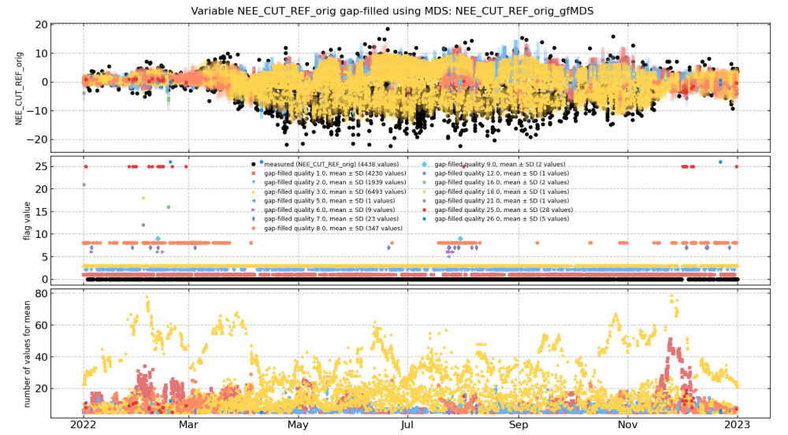
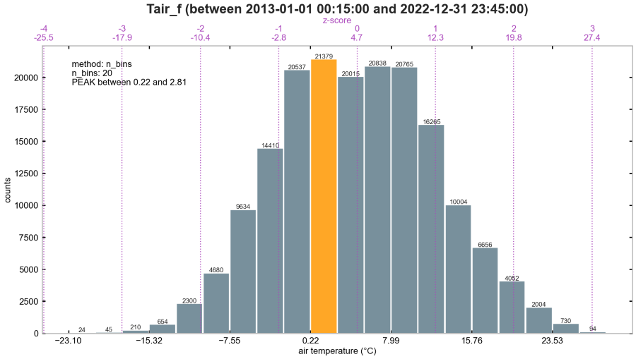

# Changelog


## v0.87.0 | XX Mar 2025

### Heatmap rank plot

`diive` can now create heatmap rank plots.


This visualization displays the relative ranking of monthly aggregated values across multiple years. Essentially, it
shows how each month's overall value compares to the same month in other years. By default, the plot ranks the monthly
mean (average) of the selected variable.

Other aggregation methods commonly used in the `pandas` library are possible, such as `median`, `min`, `max` and `std`,
among others.

Basic example:

```
import diive as dv
hm = dv.heatmapyearmonth_ranks(series=series)  # Initialize instance, series is a pandas Series
hm.plot()  # Generate basic plot
```

See the notebook here for more examples:
`notebooks/Plotting/HeatmapYearMonthRank.ipynb`

### New features

- Added new class `.heatmapyearmonth_ranks()` to plot monthly ranks of an aggregated value across years (
  `diive.core.plotting.heatmap_datetime.HeatmapYearMonthRanks`)
- Added new function `.resample_to_monthly_agg_matrix()` to calculate a matrix of monthly aggregates across years (
  `diive.core.times.resampling.resample_to_monthly_agg_matrix`)
- Added new function `.transform_yearmonth_matrix_to_longform()` to convert monthly aggregation matrix to long-form time
  series (
  `diive.core.dfun.frames.transform_yearmonth_matrix_to_longform`)
- Added new function to calculate ET (evapotranspiration in mm h-1) from LE (latent heat flux in W m-2). (
  `diive.pkgs.createvar.conversions.et_from_le`)
- Added new function to calculate latent heat of vaporization. Originally needed for calculating ET from LE. (
  `diive.pkgs.createvar.conversions.latent_heat_of_vaporization`)

### Additions

- Heatmap plotting:
    - Heatmaps can now show the z-value for each rectangle in the plot, using the parameters `show_values` and
      `show_values_n_dec_places`. This makes more sense for data that are plotted month vs. year than for e.g.
      half-hourly data.
    - Simplified API to call heatmap plots: after `import diive as dv`, the heatmaps can now be called via
      `dv.heatmapyearmonth()` and `dv.heatmapdatetime()`.

### Notebooks

- Added new notebook for calculating a monthly aggregation matrix (`notebooks/Resampling/ResamplingMonthlyMatrix.ipynb`)
- Updated notebook `HeatmapDateTime`
- Updated notebook `HeatmapYearMonth`
- Changed name of notebook `ridgeline` to camel-case `RidgeLine`

### Unittests

- Added test case for `.et_from_le()` (`tests.test_createvar.TestCreateVar.test_conversion_et_from_le`)
- Added test case for `.resample_to_monthly_agg_matrix()`, this test also includes the transformation to long-form time
  series using `.transform_yearmonth_matrix_to_longform()` (
  `tests.test_resampling.TestResampling.test_resample_to_monthly_agg_matrix`)
- 55/55 unittests ran successfully

### Environment

- `diive` is now using Python version `3.11` upwards
- Updated environment, poetry `pyproject.toml` file now has the currently used structure

## v0.86.0 | 20 Mar 2025

### New features

### Ridgeline plot

`diive` can now create ridgeline plots.


The ridgeline plot visualizes the distribution of a quantitative variable by stacking overlapping density plots,
creating a "ridged" landscape. I think this is quite pleasing to look at. With the implementation in `diive`, it
facilitates the comparison of distributional shapes and changes of time series data across weeks, months and years.
Ridgeline plots are quite space-efficient and hopefully visually intuitive for revealing patterns and trends in data.

This is also the first function that uses a simplified API. After importing `diive`, the plot can simply be accessed via
`.ridgeline()`. This is a shortcut to access the class `RidgeLinePlot` that is otherwise deeply buried in the code
here: `diive.core.plotting.ridgeline.RidgeLinePlot`. In the future, other classes and functions will also be
accessible via similar shortforms.

Basic example:

```
import diive as dv
rp = dv.ridgeline(series=series)  # Initialize instance, series is a pandas Series
rp.plot()  # Generate basic plot
```

See the notebook here for more examples:
`notebooks/Plotting/RidgeLine.ipynb`

## Additions

- Additions to the flux processing chain:
    - Added two methods to get details about training and testing when using machine-learning models in the flux
      processing chain: `.report_traintest_model_scores()` and `.report_traintest_details()`
    - Added parameter `setflag_timeperiod` to set the flag for the SSITC to another value during certain time periods,
      for example when a time period needs stricter filtering (e.g. due to issues with the sonic anemometer). In this
      case the parameter can be used to set all values where flag=1 (medium quality data) to flag=2 (bad data).
        - Example from docstring:```
      Set flag 1 to value 2 between '2022-05-01' and '2023-09-30', and between 
      '2024-04-02' and '2024-04-19' (dates inclusive): 
      setflag_timeperiod={2: [ [1, '2022-05-01', '2023-09-30'], [1, '2024-04-02', '2024-04-19'] ]}
      ``` (`diive.pkgs.qaqc.eddyproflags.flag_ssitc_eddypro_test`)
    - Added params to export some gap-filling results (e.g. model scores) to csv files (e.g.,
      `.report_gapfilling_model_scores(outpath=...)`)
    - (`diive.pkgs.fluxprocessingchain.fluxprocessingchain.FluxProcessingChain`)
- Added check if time series has a name when plotting heatmaps. If time series does not have a name, it is automatically
  assigned the name `data`. Implemented in class `HeatmapBase` that is used by all heatmap plotters. (
  `diive.core.plotting.heatmap_base.HeatmapBase`)
- Added new filetype for 60MIN EddyPro output (`diive/configs/filetypes/EDDYPRO-FLUXNET-CSV-60MIN.yml`)

### Notebooks

- Added notebook for ridgeline plot (`notebooks/Plotting/ridgeline.ipynb`)

### Bugfixes

- Fixed bug where the flux processing chain would crash when a variable with the same name as one of the automatically
  generated variables was already present in the input data. For example, the potential radiation `SW_IN_POT` is
  generated when the flux processing chain starts and then it is added also to the input data. If the input data already
  has a variable with the same name, the processing chain would crash. Now, the automatically generated `SW_IN_POT` is
  given priority, which means the variable in the input data is overwritten. (
  `diive.pkgs.fluxprocessingchain.fluxprocessingchain.FluxProcessingChain`)

### Environment

- Updated packages

### Unittests

- 53/53 unittests ran successfully

## v0.85.7 | 26 Feb 2025

### New features

- Added class for formatting meteo data for upload to FLUXNET (`diive.pkgs.formats.meteo.FormatMeteoForFluxnetUpload`)

### Notebooks

- Added new notebook `notebooks/Formats/FormatMeteoForFluxnetUpload.ipynb`

## v0.85.6 | 25 Feb 2025

### New features

- Added class to format meteo data as input file for EddyPro flux calcs (
  `diive.pkgs.formats.meteo.FormatMeteoForEddyProFluxProcessing`)

### Changes

- Updated formatting for FLUXNET upload (`diive.pkgs.formats.fluxnet.FormatEddyProFluxnetFileForUpload`)
- `HeatmapYearMonth` plot now shows every year on y-axis (`diive.core.plotting.heatmap_datetime.HeatmapYearMonth`)
- Improved check for excluded columns when creating lagged variants (
  `diive.pkgs.createvar.laggedvariants.lagged_variants`)
- More text output when reducting features (`diive.core.ml.common.MlRegressorGapFillingBase.reduce_features`)
- Fixed colorwheel running out of colors when plotting feature ranks (
  `diive.pkgs.gapfilling.longterm.LongTermGapFillingBase.showplot_feature_ranks_per_year`)
- Less text output when filling storage term (
  `diive.pkgs.fluxprocessingchain.level31_storagecorrection.FluxStorageCorrectionSinglePointEddyPro._gapfill_storage_term`)
- Smaller fixes

### Notebooks

- Added new notebook `notebooks/Formats/FormatMeteoForEddyProFluxProcessing.ipynb`
- Updated notebook `notebooks/Formats/notebooks/Formats/FormatEddyProFluxnetFileForUpload.ipynb`

## v0.85.5 | 3 Feb 2025

### Updates to MDS gap-filling

The community-standard MDS gap-filling method for eddy covariance ecosystem fluxes (e.g., CO2 flux) is now integrated
into the `FluxProcessingChain`. MDS is used during gap-filling in flux Level-4.1.

- **Example notebook** using MDS as part of the flux processing chain where it is used together with random
  forest: [Flux Processing Chain](/notebooks/FluxProcessingChain/FluxProcessingChain.ipynb)
- **Example notebook** using MDS as stand alone class
  `FluxMDS`: [MDS gap-filling of ecosystem fluxes](/notebooks/GapFilling/FluxMDSGapFilling.ipynb)

The `diive` implementation of the MDS gap-filling method adheres to the descriptions in Reichstein et al. (2005) and
Vekuri et al. (2023), similar to the standard gap-filling procedures used by FLUXNET, ICOS, ReddyProc, and other similar
platforms. This method fills gaps by substituting missing flux values with average flux values observed under comparable
meteorological conditions.



#### Background: different flux levels

- The class `FluxProcessingChain` in `diive` follows the flux processing steps as shown in
  the [Flux Processing Chain](https://www.swissfluxnet.ethz.ch/index.php/data/ecosystem-fluxes/flux-processing-chain/)
  outlined by [Swiss FluxNet](https://www.swissfluxnet.ethz.ch/).
-
- The flux processing chain uses different levels for different steps in the chain:
    - Level-0: preliminary flux calculations, e.g. during the year,
      using [EddyPro](https://www.licor.com/products/eddy-covariance/eddypro)
    - Level-1: final flux calculations, e.g. for complete year,
      using [EddyPro](https://www.licor.com/products/eddy-covariance/eddypro)
    - Level-2: quality flag expansion (flagging)
    - Level-3.1: storage correction (using one point measurement only, from profile not included by default)
    - Level-3.2: outlier removal (flagging)
    - Level-3.3: USTAR filtering (constant threshold, must be known, detection process not included by default)  (
      flagging)
    - Following Level 3.3, a comprehensive quality flag (`QCF`) is generated by combining individual quality flags.
      Prior to subsequent processing steps, low-quality data (flag=2) is removed. Medium-quality data (flag=1) can be
      retained if necessary, while the highest quality data (flag=0) is always kept.
    - Level-4.1: gap-filling (MDS, long-term random forest)

### Changes

- Changes in `FluxMDS`:
    - Added parameter `avg_min_n_vals` in MDS gap-filling
    - Renamed tolerance parameters for MDS gap-filling to `*_tol`
    - (`diive.pkgs.gapfilling.mds.FluxMDS`)
- When reading a parquet file, sanitizing the timestamp is now optional (`diive.core.io.files.load_parquet`)
- The function for creating lagged variants is now found in `diive.pkgs.createvar.laggedvariants.lagged_variants`

### Additions

- Added more text output for fill quality during gap-filling with MDS (`diive.pkgs.gapfilling.mds.FluxMDS`)
- Added MDS gap-filling to flux processing chain (
  `diive.pkgs.fluxprocessingchain.fluxprocessingchain.FluxProcessingChain`)
- Allow fitting to unbinned data (`diive.pkgs.fits.fitter.BinFitterCP`)
- Added parameter to edit y-label (`diive.core.plotting.dielcycle.DielCycle`)
- Added preliminary USTAR filtering for NEE to quick flux processing chain (
  `diive.pkgs.fluxprocessingchain.fluxprocessingchain.QuickFluxProcessingChain`)
- `FileSplitter`:
    - Added parameter to directly output splits as `parquet` files in `FileSplitter` and `FileSplitterMulti`. These two
      classes split longer time series files (e.g., 6 hours) into several smaller splits (e.g., 12 half-hourly files).
      Usage of parquet speeds up not only the splitting part, but also the process when later re-reading the files for
      other processing steps.
    - After splitting, missing values in the split files are numpy NAN (`diive.core.io.filesplitter.FileSplitter`)
- Added parameter to hide default plot when called. The method `defaultplot` is used e.g. by outlier detection methods
  to plot the data after outlier removal, to show flagged vs. unflagged values. (
  `diive.core.base.flagbase.FlagBase.defaultplot`)
- Added new filetype `ETH-SONICREAD-BICO-MOD-CSV-20HZ`
- Added `fig` property that contains the default plot for outlier removal methods. This is useful when the default plot
  is needed elsewhere, e.g. saved to a file. At the moment, the parameter `showplot` must be `True` for the property to
  be accessible. (`diive.core.base.flagbase.FlagBase`)
    - Example for class `zScoreRolling`:
      ```
      zsr = zScoreRolling(..., showplot=True, ...)
      zsr.calc(repeat=True)
      fig = zsr.fig  # Contains the figure instance
      fig.savefig(...)  # Figure can then be saved to a file etc.
      ```  

### Notebooks

- Added notebook example for creating lagged variants of variables (
  `notebooks/CalculateVariable/Create_lagged_variants.ipynb`)
- Updated flux processing chain notebook to `v9.0`: added option for MDS gap-filling, more descriptions
- Bugfix: import for loading from `Path` was missing in flux processing chain notebook
- Updated MDS gap-filling notebook to `v1.1`, added more descriptions and example for `min_n_vals_nt` parameter
- Updated quick flux processing chain notebook

### Unittests

- Added test case `tests.test_createvar.TestCreateVar.test_lagged_variants`
- Updated test case `tests.test_gapfilling.TestGapFilling.test_fluxmds`
- Updated test case `tests.test_fluxprocessingchain.TestFluxProcessingChain.test_fluxprocessingchain`
- 53/53 unittests ran successfully

### Bugfixes

- The setting for features that should not be lagged was not properly implemented (
  `diive.pkgs.fluxprocessingchain.fluxprocessingchain.FluxProcessingChain._get_ml_feature_settings`)
- Fixed bug when plotting (`diive.pkgs.outlierdetection.localsd.LocalSD`)

## v0.84.2 | 8 Nov 2024

### Changes

- Adjust version number to avoid publishing conflict

## v0.84.1 | 8 Nov 2024

### Bugfixes

- Removed invalid imports

### Tests

- Added test case for `diive` imports (`tests.test_imports.TestImports.test_imports`)
- 52/52 unittests ran successfully

## v0.84.0 | 7 Nov 2024

### New features

- New class `BinFitterCP` for fitting function to binned data, includes confidence interval and prediction interval (
  `diive.pkgs.fits.fitter.BinFitterCP`)


### Additions

- Added small function to detect duplicate entries in lists (`diive.core.funcs.funcs.find_duplicates_in_list`)
- Added new filetype (`diive/configs/filetypes/ETH-MERCURY-CSV-20HZ.yml`)
- Added new filetype (`diive/configs/filetypes/GENERIC-CSV-HEADER-1ROW-TS-END-FULL-NS-20HZ.yml`)

### Bugfixes

- Not directly a bug fix, but when reading EddyPro fluxnet files with `LoadEddyProOutputFiles` (e.g., in the flux
  processing chain) duplicate columns are now automatically renamed by adding a numbered suffix. For example, if two
  variables are named `CUSTOM_CH4_MEAN` in the output file, they are automatically renamed to `CUSTOM_CH4_MEAN_1` and
  `CUSTOM_CH4_MEAN_2` (`diive.core.dfun.frames.compare_len_header_vs_data`)

### Notebooks

- Added notebook example for `BinFitterCP` (`notebooks/Fits/BinFitterCP.ipynb`)
- Updated flux processing chain notebook to `v8.6`, import for loading EddyPro fluxnet output files was missing

### Tests

- Added test case for `BinFitterCP` (`tests.test_fits.TestFits.test_binfittercp`)
- 51/51 unittests ran successfully

## v0.83.2 | 25 Oct 2024

From now on Python version `3.11.10` is used for developing Python (up to now, version `3.9` was used). All unittests
were successfully executed with this new Python version. In addition, all notebooks were re-run, all looked good.

[JupyterLab](https://jupyterlab.readthedocs.io/en/4.2.x/index.html) is now included in the environment, which makes it
easier to quickly install `diive` (`pip install diive`) in an environment and directly use its notebooks, without the
need to install JupyterLab separately.

### Environment

- `diive` will now be developed using Python version `3.11.10`
- Added [JupyterLab](https://jupyterlab.readthedocs.io/en/4.2.x/index.html)
- Added [jupyter bokeh](https://github.com/bokeh/jupyter_bokeh)

### Notebooks

- All notebooks were re-run and updated using Python version `3.11.10`

### Tests

- 50/50 unittests ran successfully with Python version `3.11.10`

### Changes

- Adjusted flags check in QCF flag report, the progressive flag must be the same as the previously calculated overall
  flag (`diive.pkgs.qaqc.qcf.FlagQCF.report_qcf_evolution`)

## v0.83.1 | 23 Oct 2024

## Changes

- When detecting the frequency from the time delta of records, the inferred frequency is accepted if the most frequent
  timedelta was found for more than 50% of records (`diive.core.times.times.timestamp_infer_freq_from_timedelta`)
- Storage terms are now gap-filled using the rolling median in an expanding time window (
  `FluxStorageCorrectionSinglePointEddyPro._gapfill_storage_term`)

## Notebooks

- Added notebook example for using the flux processing chain for CH4 flux from a subcanopy eddy covariance station (
  `notebooks/Workbench/CH-DAS_2023_FluxProcessingChain/FluxProcessingChain_NEE_CH-DAS_2023.ipynb`)

## Bugfixes

- Fixed info for storage term correction report to account for cases when more storage terms than flux records are
  available (`FluxStorageCorrectionSinglePointEddyPro.report`)

### Tests

- 50/50 unittests ran successfully

## v0.83.0 | 4 Oct 2024

## MDS gap-filling

Finally it is possible to use the `MDS` (`marginal distribution sampling`) gap-filling method in `diive`. This method is
the current default and widely used gap-filling method for eddy covariance ecosystem fluxes. For a detailed description
of the method see Reichstein et al. (2005) and Pastorello et al. (2020; full references given below).

The implementation of `MDS` in `diive` (`FluxMDS`) follows the description in Reichstein et al. (2005) and should
therefore yield results similar to other implementations of this algorithm. `FluxMDS` can also easily output model
scores, such as r2 and error values.

At the moment it is not yet possible to use `FluxMDS` in the flux processing chain, but during the preparation of this
update the flux processing chain code was already refactored and prepared to include `FluxMDS` in one of the next
updates.

At the moment, `FluxMDS` is specifically tailored to gap-fill ecosystem fluxes, a more general implementation (e.g., to
gap-fill meteorological data) will follow.

## New features

- Added new gap-filling class `FluxMDS`:
    - `MDS` stands for `marginal distribution sampling`. The method uses a time window to first identify meteorological
      conditions (short-wave incoming radiation, air temperature and VPD) similar to those when the missing data
      occurred. Gaps are then filled with the mean flux in the time window.
    - `FluxMDS` cannot be used in the flux processing chain, but will be implemented soon.
    - (`diive.pkgs.gapfilling.mds.FluxMDS`)

### Changes

- **Storage correction**: By default, values missing in the storage term are now filled with a rolling mean in an
  expanding time window. Testing showed that the (single point) storage term is missing for between 2-3% of the data,
  which I think is reason enough to make filling these gaps the default option. Previously, it was optional to fill the
  gaps using random forest, however, results were not great since only the timestamp info was used as model features.
  Plots generated during Level-3.1 were also updated, now better showing the storage terms (gap-filled and
  non-gap-filled) and the flag indicating filled values (
  `diive.pkgs.fluxprocessingchain.level31_storagecorrection.FluxStorageCorrectionSinglePointEddyPro`)

### Notebooks

- Added notebook example for `FluxMDS` (`notebooks/GapFilling/FluxMDSGapFilling.ipynb`)

### Tests

- Added test case for `FluxMDS` (`tests.test_gapfilling.TestGapFilling.test_fluxmds`)
- 50/50 unittests ran successfully

### Bugfixes

- Fixed bug: overall quality flag `QCF` was not created correctly for the different USTAR scenarios (
  `diive.core.base.identify.identify_flagcols`) (`diive.pkgs.qaqc.qcf.FlagQCF`)
- Fixed bug: calculation of `QCF` flag sums is now strictly done on flag columns. Before, sums were calculated across
  all columns in the flags dataframe, which resulted in erroneous overall flags after USTAR filtering (
  `diive.pkgs.qaqc.qcf.FlagQCF._calculate_flagsums`)

### Environment

- Added [polars](https://pola.rs/)

### References

- Pastorello, G. et al. (2020). The FLUXNET2015 dataset and the ONEFlux processing pipeline
  for eddy covariance data. 27. https://doi.org/10.1038/s41597-020-0534-3
- Reichstein, M., Falge, E., Baldocchi, D., Papale, D., Aubinet, M., Berbigier, P., Bernhofer, C., Buchmann, N.,
  Gilmanov, T., Granier, A., Grunwald, T., Havrankova, K., Ilvesniemi, H., Janous, D., Knohl, A., Laurila, T., Lohila,
  A., Loustau, D., Matteucci, G., … Valentini, R. (2005). On the separation of net ecosystem exchange into assimilation
  and ecosystem respiration: Review and improved algorithm. Global Change Biology, 11(9),
  1424–1439. https://doi.org/10.1111/j.1365-2486.2005.001002.x

## v0.82.1 | 22 Sep 2024

## Notebooks

- Added notebook showing an example for `LongTermGapFillingRandomForestTS` (
  `notebooks/GapFilling/LongTermRandomForestGapFilling.ipynb`)
- Added notebook example for `MeasurementOffset` (`notebooks/Corrections/MeasurementOffset.ipynb`)

## Tests

- Added unittest for `LongTermGapFillingRandomForestTS` (
  `tests.test_gapfilling.TestGapFilling.test_gapfilling_longterm_randomforest`)
- Added unittest for `WindDirOffset` (`tests.test_corrections.TestCorrections.test_winddiroffset`)
- Added unittest for `DaytimeNighttimeFlag` (`tests.test_createvar.TestCreateVar.test_daytime_nighttime_flag`)
- Added unittest for `calc_vpd_from_ta_rh` (`tests.test_createvar.TestCreateVar.test_calc_vpd`)
- Added unittest for `percentiles101` (`tests.test_analyses.TestAnalyses.test_percentiles`)
- Added unittest for `GapFinder` (`tests.test_analyses.TestAnalyses.test_gapfinder`)
- Added unittest for `SortingBinsMethod` (`tests.test_analyses.TestAnalyses.test_sorting_bins_method`)
- Added unittest for `daily_correlation` (`tests.test_analyses.TestAnalyses.test_daily_correlation`)
- Added unittest for `QuantileXYAggZ` (`tests.test_analyses.TestCreateVar.test_quantilexyaggz`)
- 49/49 unittests ran successfully

### Bugfixes

- Fixed bug that caused results from long-term gap-filling to be inconsistent *despite* using a fixed random state. I
  found the following: when reducing features across years, the removal of duplicate features from a list of found
  features created a list where the order of elements changed each run. This in turn produced slightly different
  gap-filling results each time the long-term gap-filling was executed. Used Python version where this issue occurred
  was `3.9.19`.
    - Here is a simplified example, where `input_list` is a list of elements with some duplicate elements:
    - Running `output_list = list(set(input_list))` generates `output_list` where the elements would have a different
      output order each run. The elements were otherwise the same, only their order changed.
    - To keep the order of elements consistent it was necessary to `output_list.sort()`.
    - (`diive.pkgs.gapfilling.longterm.LongTermGapFillingBase.reduce_features_across_years`)
- Corrected wind direction could be 360°, but will now be 0° (
  `diive.pkgs.corrections.winddiroffset.WindDirOffset._correct_degrees`)

## v0.82.0 | 19 Sep 2024

## Long-term gap-filling

It is now possible to gap-fill multi-year datasets using the class `LongTermGapFillingRandomForestTS`. In this approach,
data from neighboring years are pooled together before training the random forest model for gap-filling a specific year.
This is especially useful for long-term, multi-year datasets where environmental conditions and drivers might change
over years and decades.

Why random forest? Because it performed well and to me it looks like the first choice for gap-filling ecosystem fluxes,
at least at the moment.

Long-term gap-filling using random forest is now also built into the flux processing chain (Level-4.1). This allows to
quickly gap-fill the different USTAR scenarios and to create some useful plots (I
hope). [See the flux processing chain notebook for how this looks like](https://github.com/holukas/diive/blob/main/notebooks/FluxProcessingChain/FluxProcessingChain.ipynb).

In a future update it will be possible to either directly switch to `XGBoost` for gap-filling, or to use it (and other
machine-learning models) in combination with random forest in the flux processing chain.

### Example

Here is an example for a dataset containing CO2 flux (`NEE`) measurements from 2005 to 2023:

- for gap-filling the year 2005, the model is trained on data from 2005, 2006 and 2007 (*2005 has no previous year*)
- for gap-filling the year 2006, the model is trained on data from 2005, 2006 and 2007 (same model as for 2005)
- for gap-filling the year 2007, the model is trained on data from 2006, 2007 and 2008
- ...
- for gap-filling the year 2012, the model is trained on data from 2011, 2012 and 2013
- for gap-filling the year 2013, the model is trained on data from 2012, 2013 and 2014
- for gap-filling the year 2014, the model is trained on data from 2013, 2014 and 2015
- ...
- for gap-filling the year 2021, the model is trained on data from 2020, 2021 and 2022
- for gap-filling the year 2022, the model is trained on data from 2021, 2022 and 2023 (same model as for 2023)
- for gap-filling the year 2023, the model is trained on data from 2021, 2022 and 2023 (*2023 has no next year*)

### New features

- Added new method for long-term (multiple years) gap-filling using random forest to flux processing chain (
  `diive.pkgs.fluxprocessingchain.fluxprocessingchain.FluxProcessingChain.level41_gapfilling_longterm`)
- Added new class for long-term (multiple years) gap-filling using random forest (
  `diive.pkgs.gapfilling.longterm.LongTermGapFillingRandomForestTS`)
- Added class for plotting cumulative sums across all data, for multiple columns (
  `diive.core.plotting.cumulative.Cumulative`)
- Added class to detect a constant offset between two measurements (
  `diive.pkgs.corrections.measurementoffset.MeasurementOffset`)

### Changes

- Creating lagged variants creates gaps which then leads to incomplete features in machine learning models. Now, gaps
  are filled using simple forward and backward filling, limited to the number of values defined in *lag*. For example,
  if variable TA is lagged by -2 value this creates two missing values for this variant at the start of the time series,
  which then are then gap-filled using the simple backwards fill with `limit=2`. (
  `diive.core.dfun.frames.lagged_variants`)

### Notebooks

- Updated flux processing chain notebook to include long-term gap-filling using random forest (
  `notebooks/FluxProcessingChain/FluxProcessingChain.ipynb`)
- Added new notebook for plotting cumulative sums across all data, for multiple columns (
  `notebooks/Plotting/Cumulative.ipynb`)

### Tests

- Unittest for flux processing chain now includes many more methods (
  `tests.test_fluxprocessingchain.TestFluxProcessingChain.test_fluxprocessingchain`)
- 39/39 unittests ran successfully

### Bugfixes

- Fixed deprecation warning in (`diive.core.ml.common.prediction_scores_regr`)

## v0.81.0 | 11 Sep 2024

## Expanding Flux Processing Capabilities

This update brings advancements for post-processing eddy covariance data in the context of the `FluxProcessingChain`.
The goal is to offer a complete chain for post-processing ecosystem flux data, specifically designed to work seamlessly
with the standardized `_fluxnet` output file from the
widely-used [EddyPro](https://www.licor.com/env/products/eddy-covariance/eddypro) software.

Now, diive offers the option for USTAR filtering based on *known* constant thresholds across the entire dataset (similar
to the `CUT` scenarios in FLUXNET data). While seasonal (DJF, MAM, JJA, SON) thresholds are calculated internally,
applying them on a seasonal basis or using variable thresholds per year (like FLUXNET's `VUT` scenarios) isn't yet
implemented.

With this update, the `FluxProcessingChain` class can handle various data processing steps:

- Level-2: Quality flag expansion
- Level-3.1: Storage correction
- Level-3.2: Outlier removal
- Level-3.3: (new) USTAR filtering (with constant thresholds for now)
- (upcoming) Level-4.1: long-term gap-filling using random forest and XGBoost
- For info about the different flux levels
  see [Swiss FluxNet flux processing chain](https://www.swissfluxnet.ethz.ch/index.php/data/ecosystem-fluxes/flux-processing-chain/)

### New features

- Added class to apply multiple known constant USTAR (friction velocity) thresholds, creating flags that indicate time
  periods characterized by low turbulence for multiple USTAR scenarios. The constant thresholds must be known
  beforehand, e.g., from an earlier USTAR detection run, or from results from FLUXNET (
  `diive.pkgs.flux.ustarthreshold.FlagMultipleConstantUstarThresholds`)
- Added class to apply one single known constant USTAR thresholds (
  `diive.pkgs.flux.ustarthreshold.FlagSingleConstantUstarThreshold`)
- Added `FlagMultipleConstantUstarThresholds` to the flux processing chain (
  `diive.pkgs.fluxprocessingchain.fluxprocessingchain.FluxProcessingChain.level33_constant_ustar`)
- Added USTAR detection algorithm based on Papale et al., 2006 (`diive.pkgs.flux.ustarthreshold.UstarDetectionMPT`)
- Added function to analyze high-quality ecosystem fluxes that helps in understanding the range of highest-quality data(
  `diive.pkgs.flux.hqflux.analyze_highest_quality_flux`)

### Additions

- `LocalSD` outlier detection can now use a constant SD:
    - Added parameter to use standard deviation across all data (constant) instead of the rolling SD to calculate the
      upper and lower limits that define outliers in the median rolling window (
      `diive.pkgs.outlierdetection.localsd.LocalSD`)
    - Added to step-wise outlier detection (
      `diive.pkgs.outlierdetection.stepwiseoutlierdetection.StepwiseOutlierDetection.flag_outliers_localsd_test`)
    - Added to meteoscreening from database (
      `diive.pkgs.qaqc.meteoscreening.StepwiseMeteoScreeningDb.flag_outliers_localsd_test`)
    - Added to flux processing chain (
      `diive.pkgs.fluxprocessingchain.fluxprocessingchain.FluxProcessingChain.level32_flag_outliers_localsd_test`)

### Changes

- Replaced `.plot_date()` from the Matplotlib library with `.plot()` due to deprecation

### Notebooks

- Added notebook for plotting cumulative sums per year (`notebooks/Plotting/CumulativesPerYear.ipynb`)
- Added notebook for removing outliers based on the z-score in rolling time window (
  `notebooks/OutlierDetection/zScoreRolling.ipynb`)

### Bugfixes

- Fixed bug when saving a pandas Series to parquet (`diive.core.io.files.save_parquet`)
- Fixed bug when plotting `doy_mean_cumulative`: no longer crashes when years defined in parameter
  `excl_years_from_reference` are not in dataset (`diive.core.times.times.doy_mean_cumulative`)
- Fixed deprecation warning when plotting in `bokeh` (interactive plots)

### Tests

- Added unittest for `LocalSD` using constant SD (
  `tests.test_outlierdetection.TestOutlierDetection.test_localsd_with_constantsd`)
- Added unittest for rolling z-score outlier removal (
  `tests.test_outlierdetection.TestOutlierDetection.test_zscore_rolling`)
- Improved check if figure and axis were created in (`tests.test_plots.TestPlots.test_histogram`)
- 39/39 unittests ran successfully

### Environment

- Added new package `scikit-optimize`
- Added new package `category_encoders`

## v0.80.0 | 28 Aug 2024

### Additions

- Added outlier tests to step-wise meteoscreening from database: `Hampel`, `HampelDaytimeNighttime` and `TrimLow` (
  `diive.pkgs.qaqc.meteoscreening.StepwiseMeteoScreeningDb`)
- Added parameter to control whether or not to output the middle timestamp when loading parquet files with
  `load_parquet()`. By default, `output_middle_timestamp=True`. (`diive.core.io.files.load_parquet`)

### Environment

- Re-created environment and created new `lock` file
- Currently using Python 3.9.19

### Notebooks

- Added new notebook for creating a flag that indicates missing values (
  `notebooks/OutlierDetection/MissingValues.ipynb`)
- Updated notebook for meteoscreening from database (
  `notebooks/MeteoScreening/StepwiseMeteoScreeningFromDatabase.ipynb`)
- Updated notebook for loading and saving parquet files (`notebooks/Formats/LoadSaveParquetFile.ipynb`)

### Tests

- Added unittest for flagging missing values (`tests.test_outlierdetection.TestOutlierDetection.test_missing_values`)
- 37/37 unittests ran successfully

### Bugfixes

- Fixed links in README, needed absolute links to notebooks
- Fixed issue with return list in (`diive.pkgs.analyses.histogram.Histogram.peakbins`)

## v0.79.1 | 26 Aug 2024

### Additions

- Added new function to apply quality flags to certain time periods only (`diive.pkgs.qaqc.flags.restrict_application`)
- Added to option to restrict the application of the angle-of-attack flag to certain time periods (
  `diive.pkgs.fluxprocessingchain.level2_qualityflags.FluxQualityFlagsEddyPro.angle_of_attack_test`)

### Changes

- Test options in `FluxProcessingChain` are now always passed as dict. This has the advantage that in addition to run
  the test by setting the dict key `apply` to `True`, various other test settings can be passed, for example the new
  parameter `application dates` for the angle-of-attack flag. (
  `diive.pkgs.fluxprocessingchain.fluxprocessingchain.FluxProcessingChain`)

### Tests

- Added unittest for Flux Processing Chain up to Level-2 (
  `tests.test_fluxprocessingchain.TestFluxProcessingChain.test_fluxprocessingchain_level2`)
- 36/36 unittests ran successfully

## v0.79.0 | 22 Aug 2024

This version introduces a histogram plot that has the option to display z-score as vertical lines superimposed on the
distribution, which helps in assessing z-score settings used by some outlier removal functions.



*Histogram plot of half-hourly air temperature measurements at the ICOS Class 1 ecosystem
station [Davos](https://www.swissfluxnet.ethz.ch/index.php/sites/site-info-ch-dav/) between 2013 and 2022, displayed in
20 equally-spaced bins. The dashed vertical lines show the z-score and the corresponding value calculated based on the
time series. The bin with most counts is highlighted orange.*

### New features

- Added new class `HistogramPlot`for plotting histograms, based on the Matplotlib
  implementation (`diive.core.plotting.histogram.HistogramPlot`)
- Added function to calculate the value for a specific z-score, e.g., based on a time series it calculates the value
  where z-score = `3` etc. (`diive.core.funcs.funcs.val_from_zscore`)

### Additions

- Added histogram plots to `FlagBase`, histograms are now shown for all outlier methods (
  `diive.core.base.flagbase.FlagBase.defaultplot`)
- Added daytime/nighttime histogram plots to (`diive.pkgs.outlierdetection.hampel.HampelDaytimeNighttime`)
- Added daytime/nighttime histogram plots to (`diive.pkgs.outlierdetection.zscore.zScoreDaytimeNighttime`)
- Added daytime/nighttime histogram plots to (`diive.pkgs.outlierdetection.lof.LocalOutlierFactorDaytimeNighttime`)
- Added daytime/nighttime histogram plots to (
  `diive.pkgs.outlierdetection.absolutelimits.AbsoluteLimitsDaytimeNighttime`)
- Added option to calculate the z-score with sign instead of absolute (`diive.core.funcs.funcs.zscore`)

### Changes

- Improved daytime/nighttime outlier plot used by various outlier removal classes (
  `diive.core.base.flagbase.FlagBase.plot_outlier_daytime_nighttime`)

### Notebooks

- Added notebook for plotting histograms (`notebooks/Plotting/Histogram.ipynb`)
- Added notebook for manual removal of data points (`notebooks/OutlierDetection/ManualRemoval.ipynb`)
- Added notebook for outlier detection using local outlier factor, separately during daytime and nighttime (
  `notebooks/OutlierDetection/LocalOutlierFactorDaytimeNighttime.ipynb`)
- Updated notebook (`notebooks/OutlierDetection/HampelDaytimeNighttime.ipynb`)
- Updated notebook (`notebooks/OutlierDetection/AbsoluteLimitsDaytimeNighttime.ipynb`)
- Updated notebook (`notebooks/OutlierDetection/zScoreDaytimeNighttime.ipynb`)
- Updated notebook (`notebooks/OutlierDetection/LocalOutlierFactorAllData.ipynb`)

### Tests

- Added unittest for plotting histograms (`tests.test_plots.TestPlots.test_histogram`)
- Added unittest for calculating histograms (without plotting) (`tests.test_analyses.TestCreateVar.test_histogram`)

## v0.78.1.1 | 19 Aug 2024

### Additions

- Added CITATIONS file

## v0.78.1 | 19 Aug 2024

### Changes

- Added option to set different `n_sigma` for daytime and nightime data
  in `HampelDaytimeNighttime` (`diive.pkgs.outlierdetection.hampel.HampelDaytimeNighttime`)
- Updated `flag_outliers_hampel_dtnt_test` in step-wise outlier detection
- Updated `level32_flag_outliers_hampel_dtnt_test` in flux processing chain

### Notebooks

- Updated notebook `HampelDaytimeNighttime`
- Updated notebook `FluxProcessingChain`

### Tests

- Updated unittest `test_hampel_filter_daytime_nighttime`
- 35/35 unittests ran successfully

## v0.78.0 | 18 Aug 2024

### New features

- Added new class for outlier removal, based on the rolling z-score. It can also be used in step-wise outlier detection
  and during meteoscreening from the
  database. (`diive.pkgs.outlierdetection.zscore.zScoreRolling`,
  `diive.pkgs.outlierdetection.stepwiseoutlierdetection.StepwiseOutlierDetection`,
  `diive.pkgs.qaqc.meteoscreening.StepwiseMeteoScreeningDb`).
- Added Hampel filter for outlier removal (`diive.pkgs.outlierdetection.hampel.Hampel`)
- Added Hampel filter (separate daytime, nighttime) for outlier
  removal (`diive.pkgs.outlierdetection.hampel.HampelDaytimeNighttime`)
- Added function to plot daytime and nighttime outliers during outlier
  tests (`diive.core.plotting.outlier_dtnt.outlier_daytime_nighttime`)

### Changes

- Flux processing chain:
    - Several changes to the flux processing chain to make sure it can also work with data files not directly output by
      EddyPro. The class `FluxProcessingChain` can now handle files that have a different format than the two EddyPro
      output files `EDDYPRO-FLUXNET-CSV-30MIN` and `EDDYPRO-FULL-OUTPUT-CSV-30MIN`. See following notes.
    - Removed option to process EddyPro `_full_output_` files, since it as an older format and its variables do not
      follow FLUXNET conventions.
    - Removed keyword `filetype` in class `FluxProcessingChain`. It is now assumed that the variable names follow the
      FLUXNET convention. Variables used in FLUXNET are
      listed [here](https://fluxnet.org/data/fluxnet2015-dataset/fullset-data-product/) (
      `diive.pkgs.fluxprocessingchain.fluxprocessingchain.FluxProcessingChain`)
    - When detecting the base variable from which a flux variable was calculated, the variables defined for
      filetype `EDDYPRO-FLUXNET-CSV-30MIN` are now assumed by default. (`diive.pkgs.flux.common.detect_basevar`)
    - Renamed function that detects the base variable that was used to calculate the respective
      flux  (`diive.pkgs.flux.common.detect_fluxbasevar`)
    - Renamed `gas` in functions related to completeness tests to `fluxbasevar` to better reflect that the completeness
      test does not necessarily require a gas (e.g. `T_SONIC` is used to calculate the completeness for sensible heat
      flux) (`flag_fluxbasevar_completeness_eddypro_test`)
- Removing the radiation offset now uses `0.001` (W m-2) instead of `50` as the threshold value to flag nighttime values
  for the correction (`diive.pkgs.corrections.offsetcorrection.remove_radiation_zero_offset`)
- The database tag for meteo data screened with `diive` is
  now `meteoscreening_diive` (`diive.pkgs.qaqc.meteoscreening.StepwiseMeteoScreeningDb.resample`)
- During noise generation, function now uses the absolute values of the min/max of a series to calculate minimum noise
  and maximum noise (`diive.pkgs.createvar.noise.add_impulse_noise`)

### Notebooks

- Added new notebook for outlier detection using class `zScore` (`notebooks/OutlierDetection/zScore.ipynb`)
- Added new notebook for outlier detection using
  class `zScoreDaytimeNighttime` (`notebooks/OutlierDetection/zScoreDaytimeNighttime.ipynb`)
- Added new notebook for outlier removal using trimming (`notebooks/OutlierDetection/TrimLow.ipynb`)
- Updated notebook (`notebooks/MeteoScreening/StepwiseMeteoScreeningFromDatabase_v7.0.ipynb`)
- When uploading screened meteo data to the database using the notebook `StepwiseMeteoScreeningFromDatabase`, variables
  with the same name, measurement and data version as the screened variable(s) are now deleted from the database before
  the new data are uploaded. Implemented in the Python package `dbc-influxdb` to avoid duplicates in the database. Such
  duplicates can occur when one of the tags of an otherwise identical variable changed, e.g., when one of the tags of
  the originally uploaded data was wrong and needed correction. The database `InfluxDB` stores a new time series
  alongside the previous time series when one of the tags is different in an otherwise identical time series.

### Tests

- Added test case for `Hampel` filter (`tests.test_outlierdetection.TestOutlierDetection.test_hampel_filter`)
- Added test case for `HampelDaytimeNighttime`
  filter (`tests.test_outlierdetection.TestOutlierDetection.test_hampel_filter_daytime_nighttime`)
- Added test case for `zScore` (`tests.test_outlierdetection.TestOutlierDetection.test_zscore`)
- Added test case for `TrimLow` (`tests.test_outlierdetection.TestOutlierDetection.test_trim_low_nt`)
- Added test case
  for `zScoreDaytimeNighttime` (`tests.test_outlierdetection.TestOutlierDetection.test_zscore_daytime_nighttime`)
- 33/33 unittests ran successfully

### Environment

- Added package [sktime](https://www.sktime.net/en/stable/index.html), a unified framework for machine learning with
  time series.

## v0.77.0 | 11 Jun 2024

### Additions

- Plotting cumulatives with `CumulativeYear` now also shows the cumulative for the reference, i.e. for the mean over the
  reference years (`diive.core.plotting.cumulative.CumulativeYear`)
- Plotting `DielCycle` now accepts `ylim` parameter (`diive.core.plotting.dielcycle.DielCycle`)
- Added long-term dataset for local testing purposes (internal
  only) (`diive.configs.exampledata.load_exampledata_parquet_long`)
- Added several classes in preparation for long-term gap-filling for a future update

### Changes

- Several updates and changes to the base class for regressor decision
  trees (`diive.core.ml.common.MlRegressorGapFillingBase`):
    - The data are now split into training set and test set at the very start of regressor setup. This test set is used
      to evaluate models on unseen data. The default split is 80% training and 20% test data.
    - Plotting (scores, importances etc.) is now generally separated from the method where they are calculated.
    - the same `random_state` is now used for all processing steps
    - refactored code
    - beautified console output
- When correcting for relative humidity values above 100%, the maximum of the corrected time series is now set to 100,
  after the (daily) offset was removed (`diive.pkgs.corrections.offsetcorrection.remove_relativehumidity_offset`)
- During feature reduction in machine learning regressors, features with permutation importance < 0 are now always
  removed (`diive.core.ml.common.MlRegressorGapFillingBase._remove_rejected_features`)
- Changed default parameters for quick random forest gap-filling (`diive.pkgs.gapfilling.randomforest_ts.QuickFillRFTS`)
- I tried to improve the console output (clarity) for several functions and methods

### Environment

- Added package [dtreeviz](https://github.com/parrt/dtreeviz?tab=readme-ov-file) to visualize decision trees

### Notebooks

- Updated notebook (`notebooks/GapFilling/RandomForestGapFilling.ipynb`)
- Updated notebook (`notebooks/GapFilling/LinearInterpolation.ipynb`)
- Updated notebook (`notebooks/GapFilling/XGBoostGapFillingExtensive.ipynb`)
- Updated notebook (`notebooks/GapFilling/XGBoostGapFillingMinimal.ipynb`)
- Updated notebook (`notebooks/GapFilling/RandomForestParamOptimization.ipynb`)
- Updated notebook (`notebooks/GapFilling/QuickRandomForestGapFilling.ipynb`)

### Tests

- Updated and fixed test case (`tests.test_outlierdetection.TestOutlierDetection.test_zscore_increments`)
- Updated and fixed test case (`tests.test_gapfilling.TestGapFilling.test_gapfilling_randomforest`)

## v0.76.2 | 23 May 2024

### Additions

- Added function to calculate absolute double differences of a time series, which is the sum of absolute differences
  between a data record and its preceding and next record. Used in class `zScoreIncrements` for finding (isolated)
  outliers that are distant from neighboring records. (`diive.core.dfun.stats.double_diff_absolute`)
- Added small function to calculate z-score stats of a time series (`diive.core.dfun.stats.sstats_zscore`)
- Added small function to calculate stats for absolute double differences of a time
  series (`diive.core.dfun.stats.sstats_doublediff_abs`)

### Changes

- Changed the algorithm for outlier detection when using `zScoreIncrements`. Data points are now flagged as outliers if
  the z-scores of three absolute differences (previous record, next record and the sum of both) all exceed a specified
  threshold.  (`diive.pkgs.outlierdetection.incremental.zScoreIncrements`)

### Notebooks

- Added new notebook for outlier detection using
  class `LocalOutlierFactorAllData` (`notebooks/OutlierDetection/LocalOutlierFactorAllData.ipynb`)

### Tests

- Added new test case
  for `LocalOutlierFactorAllData` (`tests.test_outlierdetection.TestOutlierDetection.test_lof_alldata`)

## v0.76.1 | 17 May 2024

### Additions

- It is now possible to set a fixed random seed when creating impulse
  noise (`diive.pkgs.createvar.noise.add_impulse_noise`)

### Changes

- In class `zScoreIncrements`, outliers are now detected by calculating the sum of the absolute differences between a
  data point and its respective preceding and next data point. Before, only the non-absolute difference of the preceding
  data point was considered. The sum of absolute differences is then used to calculate the z-score and in further
  consequence to flag outliers. (`diive.pkgs.outlierdetection.incremental.zScoreIncrements`)

### Notebooks

- Added new notebook for outlier detection using
  class `zScoreIncrements` (`notebooks/OutlierDetection/zScoreIncremental.ipynb`)
- Added new notebook for outlier detection using
  class `LocalSD` (`notebooks/OutlierDetection/LocalSD.ipynb`)

### Tests

- Added new test case for `zScoreIncrements` (`tests.test_outlierdetection.TestOutlierDetection.test_zscore_increments`)
- Added new test case for `LocalSD` (`tests.test_outlierdetection.TestOutlierDetection.test_localsd`)

## v0.76.0 | 14 May 2024

### Diel cycle plot

The new class `DielCycle` allows to plot diel cycles per month or across all data for time series data. At the moment,
it plots the (monthly) diel cycles as means (+/- standard deviation). It makes use of the time info contained in the
datetime timestamp index of the data. All aggregates are calculated by grouping data by time and (optional) separately
for each month. The diel cycles have the same time resolution as the time component of the timestamp index, e.g. hourly.


### New features

- Added new class `DielCycle` for plotting diel cycles per month (`diive.core.plotting.dielcycle.DielCycle`)
- Added new function `diel_cycle` for calculating diel cycles per month. This function is also used by the plotting
  class `DielCycle` (`diive.core.times.resampling.diel_cycle`)

### Additions

- Added color scheme that contains 12 colors, one for each month. Not perfect, but better than
  before. (`diive.core.plotting.styles.LightTheme.colors_12_months`)

### Notebooks

- Added new notebook for plotting diel cycles (per month) (`notebooks/Plotting/DielCycle.ipynb`)
- Added new notebook for calculating diel cycles (per month) (`notebooks/Resampling/ResamplingDielCycle.ipynb`)

### Tests

- Added test case for new function `diel_cycle` (`tests.test_resampling.TestResampling.test_diel_cycle`)

## v0.75.0 | 26 Apr 2024

### XGBoost gap-filling

[XGBoost](https://xgboost.readthedocs.io/en/stable/index.html) can now be used to fill gaps in time series data.
In `diive`, `XGBoost` is implemented in class `XGBoostTS`, which adds additional options for easily including e.g.
lagged variants of feature variables, timestamp info (DOY, month, ...) and a continuous record number. It also allows
direct feature reduction by including a purely random feature (consisting of completely random numbers) and calculating
the 'permutation importance'. All features where the permutation importance is lower than for the random feature can
then be removed from the dataset, i.e., the list of features, before building the final model.

`XGBoostTS` and `RandomForestTS` both use the same base class `MlRegressorGapFillingBase`. This base class will also
facilitate the implementation of other gap-filling algorithms in the future.

Another fun (for me) addition is the new class `TimeSince`. It allows to calculate the time since the last occurrence of
specific conditions. One example where this class can be useful is the calculation of 'time since last precipitation',
expressed as number of records, which can be helpful in identifying dry conditions. More examples: 'time since freezing
conditions' based on air temperature; 'time since management' based on management info, e.g. fertilization events.
Please see the notebook for some illustrative examples.

**Please note that `diive` is still under developement and bugs can be expected.**

### New features

- Added gap-filling class `XGBoostTS` for time series data,
  using [XGBoost](https://xgboost.readthedocs.io/en/stable/index.html) (`diive.pkgs.gapfilling.xgboost_ts.XGBoostTS`)
- Added new class `TimeSince`: counts number of records (inceremental number / counter) since the last time a time
  series was inside a specified range, useful for e.g. counting the time since last precipitation, since last freezing
  temperature, etc. (`diive.pkgs.createvar.timesince.TimeSince`)

### Additions

- Added base class for machine learning regressors, which is basically the code shared between the different
  methods. At the moment used by `RandomForestTS` and `XGBoostTS`. (`diive.core.ml.common.MlRegressorGapFillingBase`)
- Added option to change line color directly in `TimeSeries` plots (`diive.core.plotting.timeseries.TimeSeries.plot`)

### Notebooks

- Added new notebook for gap-filling using `XGBoostTS` with mininmal
  settings (`notebooks/GapFilling/XGBoostGapFillingMinimal.ipynb`)
- Added new notebook for gap-filling using `XGBoostTS` with more extensive
  settings (`notebooks/GapFilling/XGBoostGapFillingExtensive.ipynb`)
- Added new notebook for creating `TimeSince` variables (`notebooks/CalculateVariable/TimeSince.ipynb`)

### Tests

- Added test case for XGBoost gap-filling (`tests.test_gapfilling.TestGapFilling.test_gapfilling_xgboost`)
- Updated test case for random forest gap-filling (`tests.test_gapfilling.TestGapFilling.test_gapfilling_randomforest`)
- Harmonized test case for XGBoostTS with test case of RandomForestTS
- Added test case for `TimeSince` variable creation (`tests.test_createvar.TestCreateVar.test_timesince`)

## v0.74.1 | 23 Apr 2024

This update adds the first notebooks (and tests) for outlier detection methods. Only two tests are included so far and
both tests are relatively simple, but both notebooks already show in principle how outlier removal is handled. An
important aspect is that `diive` single outlier methods do not remove outliers by default, but instead a flag is created
that shows where the outliers are located. The flag can then be used to remove the data points.  
This update also includes the addition of a small function that creates artificial spikes in time series data and is
therefore very useful for testing outlier detection methods.  
More outlier removal notebooks will be added in the future, including a notebook that shows how to combine results from
multiple outlier tests into one single overall outlier flag.

### New features

- **Added**: new function to add impulse noise to time series (`diive.pkgs.createvar.noise.impulse`)

### Notebooks

- **Added**: new notebook for outlier detection: absolute limits, separately for daytime and nighttime
  data (`notebooks/OutlierDetection/AbsoluteLimitsDaytimeNighttime.ipynb`)
- **Added**: new notebook for outlier detection: absolute limits (`notebooks/OutlierDetection/AbsoluteLimits.ipynb`)

### Tests

- **Added**: test case for outlier detection: absolute limits, separately for daytime and
  nighttime data (`tests.test_outlierdetection.TestOutlierDetection.test_absolute_limits`)
- **Added**: test case for outlier detection: absolute
  limits (`tests.test_outlierdetection.TestOutlierDetection.test_absolute_limits`)

## v0.74.0 | 21 Apr 2024

### Additions

- **Added**: new function to remove rows that do not have timestamp
  info (`NaT`) (`diive.core.times.times.remove_rows_nat` and `diive.core.times.times.TimestampSanitizer`)
- **Added**: new settings `VARNAMES_ROW` and `VARUNITS_ROW` in filetypes YAML files, allows better and more specific
  configuration when reading data files (`diive/configs/filetypes`)
- **Added**: many (small) example data files for various filetypes, e.g. `ETH-RECORD-TOA5-CSVGZ-20HZ`
- **Added**: new optional check in `TimestampSanitizer` that compares the detected time resolution of a time series with
  the nominal (expected) time resolution. Runs automatically when reading files with `ReadFileType`, in which case
  the `FREQUENCY` from the filetype configs is used as the nominal time
  resolution. (`diive.core.times.times.TimestampSanitizer`, `diive.core.io.filereader.ReadFileType`)
- **Added**: application of `TimestampSanitizer` after inserting a timestamp and setting it as index with
  function `insert_timestamp`, this makes sure the freq/freqstr info is available for the new timestamp
  index (`diive.core.times.times.insert_timestamp`)

### Notebooks

- General: Ran all notebook examples to make sure they work with this version of `diive`
- **Added**: new notebook for reading EddyPro _fluxnet_ output file with `DataFileReader`
  parameters (`notebooks/ReadFiles/Read_single_EddyPro_fluxnet_output_file_with_DataFileReader.ipynb`)
- **Added**: new notebook for reading EddyPro _fluxnet_ output file with `ReadFileType` and pre-defined
  filetype `EDDYPRO-FLUXNET-CSV-30MIN` (
  `notebooks/ReadFiles/Read_single_EddyPro_fluxnet_output_file_with_ReadFileType.ipynb`)
- **Added**: new notebook for reading multiple EddyPro _fluxnet_ output files with `MultiDataFileReader` and pre-defined
  filetype `EDDYPRO-FLUXNET-CSV-30MIN` (
  `notebooks/ReadFiles/Read_multiple_EddyPro_fluxnet_output_files_with_MultiDataFileReader.ipynb`)

### Changes

- **Renamed**: function `get_len_header` to `parse_header`(`diive.core.dfun.frames.parse_header`)
- **Renamed**: exampledata files (`diive/configs/exampledata`)
- **Renamed**: filetypes YAML files to always include the file extension in the file name (`diive/configs/filetypes`)
- **Reduced**: file size for most example data files

### Tests

- **Added**: various test cases for loading filetypes (`tests/test_loaddata.py`)
- **Added**: test case for loading and merging multiple
  files (`tests.test_loaddata.TestLoadFiletypes.test_load_exampledata_multiple_EDDYPRO_FLUXNET_CSV_30MIN`)
- **Added**: test case for reading EddyPro _fluxnet_ output file with `DataFileReader`
  parameters (
  `tests.test_loaddata.TestLoadFiletypes.test_load_exampledata_EDDYPRO_FLUXNET_CSV_30MIN_datafilereader_parameters`)
- **Added**: test case for resampling series to 30MIN time
  resolution (`tests.test_time.TestTime.test_resampling_to_30MIN`)
- **Added**: test case for inserting timestamp with a different convention (middle, start,
  end) (`tests.test_time.TestTime.test_insert_timestamp`)
- **Added**: test case for inserting timestamp as index (`tests.test_time.TestTime.test_insert_timestamp_as_index`)

### Bugfixes

- **Fixed**: bug in class `DetectFrequency` when inferred frequency is `None` (`diive.core.times.times.DetectFrequency`)
- **Fixed**: bug in class `DetectFrequency` where `pd.Timedelta()` would crash if the input frequency does not have a
  number. `Timedelta` does not accept e.g. the frequency string `min` for minutely time resolution, even though
  e.g. `pd.infer_freq()` outputs `min` for data in 1-minute time resolution. `TimeDelta` requires a number, in this
  case `1min`. Results from `infer_freq()` are now checked if they contain a number and if not, `1` is added at the
  beginning of the frequency string. (`diive.core.times.times.DetectFrequency`)
- **Fixed**: bug in notebook `WindDirectionOffset`, related to frequency detection during heatmap plotting
- **Fixed**: bug in `TimestampSanitizer` where the script would crash if the timestamp contained an element that could
  not be converted to datetime, e.g., when there is a string mixed in with the regular timestamps. Data rows with
  invalid timestamps are now parsed as `NaT` by using `errors='coerce'`
  in `pd.to_datetime(data.index, errors='coerce')`.  (`diive.core.times.times.convert_timestamp_to_datetime`
  and `diive.core.times.times.TimestampSanitizer`)
- **Fixed**: bug when plotting heatmap (`diive.core.plotting.heatmap_datetime.HeatmapDateTime`)

## v0.73.0 | 17 Apr 2024

### New features

- Added new function `trim_frame` that allows to trim the start and end of a dataframe based on available records of a
  variable (`diive.core.dfun.frames.trim_frame`)
- Added new option to export borderless
  heatmaps (`diive.core.plotting.heatmap_base.HeatmapBase.export_borderless_heatmap`)

### Additions

- Added more info in comments of class `WindRotation2D` (`diive.pkgs.echires.windrotation.WindRotation2D`)
- Added example data for EddyPro full_output
  files (`diive.configs.exampledata.load_exampledata_eddypro_full_output_CSV_30MIN`)
- Added code in an attempt to harmonize frequency detection from data: in class `DetectFrequency` the detected
  frequency strings are now converted from `Timedelta` (pandas) to `offset` (pandas) to `.freqstr`. This will yield
  the frequency string as seen by (the current version of) pandas. The idea is to harmonize between different
  representations e.g. `T` or `min` for minutes (
  see [here](https://pandas.pydata.org/docs/reference/api/pandas.Timedelta.html)). (
  `diive.core.times.times.DetectFrequency`)

### Changes

- Updated class `DataFileReader` to comply with new `pandas` kwargs when
  using `.read_csv()` (`diive.core.io.filereader.DataFileReader._parse_file`)
- Environment: updated `pandas` to v2.2.2 and `pyarrow` to v15.0.2
- Updated date offsets in config filetypes to be compliant with `pandas` version 2.2+ (
  see [here](https://pandas.pydata.org/docs/reference/api/pandas.Timedelta.html)
  and [here](https://pandas.pydata.org/docs/user_guide/timeseries.html#dateoffset-objects)), e.g., `30T` was changed
  to `30min`. This seems to work without raising a warning, however, if frequency is inferred from available data,
  the resulting frequency string shows e.g. `30T`, i.e. still showing `T` for minutes instead
  of `min`. (`diive/configs/filetypes`)
- Changed variable names in `WindRotation2D` to be in line with the variable names given in the paper by Wilczak et
  al. (2001) https://doi.org/10.1023/A:1018966204465

### Removals

- Removed function `timedelta_to_string` because this can be done with pandas `to_offset().freqstr`
- Removed function `generate_freq_str` (unused)

### Tests

- Added test case for reading EddyPro full_output
  files (`tests.test_loaddata.TestLoadFiletypes.test_load_exampledata_eddypro_full_output_CSV_30MIN`)
- Updated test for frequency detection (`tests.test_timestamps.TestTime.test_detect_freq`)

## v0.72.1 | 26 Mar 2024

- `pyproject.toml` now uses the inequality syntax `>=` instead of caret syntax `^` because the version capping is
  restrictive and prevents compatibility in conda installations. See [#74](https://github.com/holukas/diive/pull/74)
- Added badges in `README.md`
- Smaller `diive` logo in `README.md`

## v0.72.0 | 25 Mar 2024

### New feature

- Added new heatmap plotting class `HeatmapYearMonth` that allows to plot a variable in year/month
  classes(`diive.core.plotting.heatmap_datetime.HeatmapYearMonth`)


### Changes

- Refactored code for class `HeatmapDateTime` (`diive.core.plotting.heatmap_datetime.HeatmapDateTime`)
- Added new base class `HeatmapBase` for heatmap plots. Currently used by `HeatmapYearMonth`
  and `HeatmapDateTime` (`diive.core.plotting.heatmap_base.HeatmapBase`)

### Notebooks

- Added new notebook for `HeatmapDateTime` (`notebooks/Plotting/HeatmapDateTime.ipynb`)
- Added new notebook for `HeatmapYearMonth` (`notebooks/Plotting/HeatmapYearMonth.ipynb`)

### Bugfixes

- Fixed bug in `HeatmapDateTime` where the last record of each day was not shown

## v0.71.6 | 23 Mar 2024


### Notebooks

- Added new notebook for `Percentiles` (`notebooks/Analyses/Percentiles.ipynb`)
- Added new notebook for `LinearInterpolation` (`notebooks/GapFilling/LinearInterpolation.ipynb`)
- Added new notebook for calculating z-aggregates in quantiles (classes) of x and
  y  (`notebooks/Analyses/CalculateZaggregatesInQuantileClassesOfXY.ipynb`)
- Updated notebook for `DaytimeNighttimeFlag` (`notebooks/CalculateVariable/DaytimeNighttimeFlag.ipynb`)

## v0.71.5 | 22 Mar 2024

### Changes

- Updated notebook for `SortingBinsMethod` (`diive.pkgs.analyses.decoupling.SortingBinsMethod`)


*Plot showing vapor pressure deficit (y) in 10 classes of short-wave incoming radiation (x), separate for 5 classes of
air temperature (z). All values shown are medians of the respective variable. The shaded errorbars refer to the
interquartile range for the respective class. Plot was generated using the class `SortingBinsMethod`.*

## v0.71.4 | 20 Mar 2024

### Changes

- Refactored class `LongtermAnomaliesYear` (`diive.core.plotting.bar.LongtermAnomaliesYear`)


### Notebooks

- Added new notebook for `LongtermAnomaliesYear` (`notebooks/Plotting/LongTermAnomalies.ipynb`)

## v0.71.3 | 19 Mar 2024

### Changes

- Refactored class `SortingBinsMethod`: Allows to investigate binned aggregates of a variable z in binned classes of x
  and y. All bins now show medians and interquartile
  ranges. (`diive.pkgs.analyses.decoupling.SortingBinsMethod`)

### Notebooks

- Added new notebook for `SortingBinsMethod`

### Bugfixes

- Added absolute links to example notebooks in `README.md`

### Other

- From now on, `diive` is officially published on [pypi](https://pypi.org/project/diive/)

## v0.71.2 | 18 Mar 2024

### Notebooks

- Added new notebook for `daily_correlation` function (`notebooks/Analyses/DailyCorrelation.ipynb`)
- Added new notebook for `Histogram` class (`notebooks/Analyses/Histogram.ipynb`)

### Bugfixes & changes

- Daily correlations are now returned with daily (`1d`) timestamp
  index (`diive.pkgs.analyses.correlation.daily_correlation`)
- Updated README
- Environment: Added [ruff](https://github.com/astral-sh/ruff) to dev dependencies for linting

## v0.71.1 | 15 Mar 2024

### Bugfixes & changes

- Fixed: Replaced all references to old filetypes using the underscore to their respective new filetype names,
  e.g. all occurrences of `EDDYPRO_FLUXNET_30MIN` were replaced with the new name `EDDYPRO-FLUXNET-CSV-30MIN`.
- Environment: Python 3.11 is now allowed in `pyproject.toml`: `python = ">=3.9,<3.12"`
- Environment: Removed `fitter` library from dependencies, was not used.
- Docs: Testing documentation generation using [Sphinx](https://www.sphinx-doc.org/en/master/), although it looks very
  rough at the moment.

## v0.71.0 | 14 Mar 2024

### High-resolution update

This update focuses on the implementation of several classes that work with high-resolution (20 Hz) data.

The main motivation behind these implementations is the upcoming new version of another
script, [dyco](https://github.com/holukas/dyco), which will make direct use of these new classes. `dyco` allows
to detect and remove time lags from time series data and can also handle drifting lags, i.e., lags that
are not constant over time. This is especially useful for eddy covariance data, where the detection of
accurate time lags is of high importance for the calculation of ecosystem fluxes.


*Plot showing the covariance between the turbulent departures of vertical wind and CO2 measurements.
Maximum (absolute) covariance was found at record -26, which means that the CO2 signal has to be shifted
by 26 records in relation to the wind data to obtain the maximum covariance between the two variables.
Since the covariance was calculated on 20 Hz data, this corresponds to a time lag of 1.3 seconds
between CO2 and wind (20 Hz = measurement every 0.05 seconds, 26 * 0.05 = 1.3), or, to put it
another way, the CO2 signal arrived 1.3 seconds later at the sensor than the wind signal. Maximum
covariance was calculated using the `MaxCovariance` class.*

### New features

- Added new class `MaxCovariance` to find the maximum covariance between two
  variables (`diive.pkgs.echires.lag.MaxCovariance`)
- Added new class `FileDetector` to detect expected and unexpected files from a list of
  files (`diive.core.io.filesdetector.FileDetector`)
- Added new class `FileSplitter` to split file into multiple smaller parts and export them as multiple CSV
  files. (`diive.core.io.filesplitter.FileSplitter`)
- Added new class `FileSplitterMulti` to split multiple files into multiple smaller parts
  and save them as CSV or compressed CSV files. (`diive.core.io.filesplitter.FileSplitterMulti`)
- Added new function `create_timestamp` that calculates the timestamp for each record in a dataframe,
  based on number of records in the file and the file duration. (`diive.core.times.times.create_timestamp`)

### Additions

- Added new filetype `ETH-SONICREAD-BICO-CSVGZ-20HZ`, these files contain data that were originally logged
  by the `sonicread` script which is in use in the [ETH Grassland Sciences group](https://gl.ethz.ch/) since the early
  2000s to record eddy covariance data within the [Swiss FluxNet](https://www.swissfluxnet.ethz.ch/). Data were
  then converted to a regular format using the Python script [bico](https://github.com/holukas/bico), which
  also compressed the resulting CSV files to `gz` files (`gzipped`).
- Added new filetype `GENERIC-CSV-HEADER-1ROW-TS-MIDDLE-FULL-NS-20HZ`, which corresponds to a CSV file with
  one header row with variable names, a timestamp that describes the middle of the averaging period, whereby
  the timestamp also includes nanoseconds. Time resolution of the file is 20 Hz.

### Changes

- Renamed class `TurbFlux` to `WindRotation2D` and updated code a bit, e.g., now it is possible to get
  rotated values for all three wind components (`u'`, `v'`, `w'`) in addition to the rotated
  scalar `c'`. (`diive.pkgs.echires.windrotation.WindRotation2D`)
- Renamed filetypes: all filetypes now use the dash instead of an underscore
- Renamed filetype to `ETH-RECORD-DAT-20HZ`: this filetype originates from the new eddy covariance real-time
  logging script `rECord` (currently not open source)
- Missing values are now defined for all files
  as: `NA_VALUES: [ -9999, -6999, -999, "nan", "NaN", "NAN", "NA", "inf", "-inf", "-" ]`

## v0.70.1 | 1 Mar 2024

- Updated (and cleaned) notebook `StepwiseMeteoScreeningFromDatabase.ipynb`

## v0.70.0 | 28 Feb 2024

### New features

- In `StepwiseOutlierDetection`, it is now possible to re-run an outlier detection method. The re-run(s)
  would produce flag(s) with the same name(s) as for the first (original) run. Therefore, an integer is added
  to the flag name. For example, if the test z-score daytime/nighttime is run the first time, it produces the
  flag with the name `FLAG_TA_T1_2_1_OUTLIER_ZSCOREDTNT_TEST`. When the test is run again (e.g. with different
  settings) then the name of the flag of this second run is `FLAG_TA_T1_2_1_OUTLIER_ZSCOREDTNT_2_TEST`,
  etc ... The script now checks whether a flag of the same name was already created, in which case an
  integer is added to the flag name. These re-runs are now available in addition to the `repeat=True` keyword.
  (`diive.pkgs.outlierdetection.stepwiseoutlierdetection.StepwiseOutlierDetection.addflag`)
  Example:
    - `METHOD` with `SETTINGS` is applied with `repeat=True` and therefore repeated until no more outliers
      were found with these settings. The name of the flag produced is `TEST_METHOD_FLAG`.
    - Next, `METHOD` is applied again with `repeat=True`, but this time with different `SETTINGS`. Like before,
      the test is repeated until no more outliers were found with the new settings. The name of the flag produced
      is `TEST_METHOD_2_FLAG`.
    - `METHOD` can be re-run any number of times, each time producing a new
      flag: `TEST_METHOD_3_FLAG`, `TEST_METHOD_4_FLAG`, ...
- Added new function to format timestamps to FLUXNET ISO
  format (`YYYYMMDDhhmm`) (`diive.core.times.times.format_timestamp_to_fluxnet_format`)

### Bugfixes

- Refactored and fixed class to reformat data for FLUXNET
  upload (`diive.pkgs.formats.fluxnet.FormatEddyProFluxnetFileForUpload`)
- Fixed `None` error when reading data files (`diive.core.io.filereader.DataFileReader._parse_file`)

### Notebooks

- Updated notebook `FormatEddyProFluxnetFileForUpload.ipynb`

## v0.69.0 | 23 Feb 2024

### New features

- Added new functions to extract info from a binary that was stored as
  integer. These functions convert a subrange of bits from an integer or an integer series to floats with an
  optional gain applied. See docstring of the respective functions for more
  info. (`diive.pkgs.binary.extract.get_encoded_value_from_int`) (`diive.pkgs.binary.extract.get_encoded_value_series`)
- Added new filetype `RECORD_DAT_20HZ` (`diive/configs/filetypes/RECORD_DAT_20HZ.yml`) for eddy covariance
  high-resolution (20Hz) raw data files recorded by the ETH `rECord` logging script.

## v0.68.1 | 5 Feb 2024

- Fixed bugs in `FluxProcessingChain`, flag creation for missing values did not work because of the missing `repeat`
  keyword (`diive.pkgs.fluxprocessingchain.fluxprocessingchain.FluxProcessingChain`)

## v0.68.0 | 30 Jan 2024

### Updates to stepwise outlier detection

Harmonized the way outlier flags are calculated. Outlier flags are all based on the same base
class `diive.core.base.flagbase.FlagBase` like before, but the base class now includes more code that
is shared by the different outlier detection methods. For example, `FlagBase` includes a method that
enables repeated execution of a single outlier detection method multiple times until all outliers
are removed. Results from all iterations are then combined into one single flag.

The class `StepwiseMeteoScreeningDb` that makes direct use of the stepwise outlier detection was
adjusted accordingly.

### Notebooks

- Updated notebook `StepwiseMeteoScreeningFromDatabase.ipynb`

### Removed features

- Removed outlier test based on seasonal-trend decomposition and z-score calculations (`OutlierSTLRZ`).
  The test worked in principle, but at the moment it is unclear how to set reliable parameters. In addition
  the test is slow when used with multiple years of high-resolution data. De-activated for the moment.

## v0.67.1 | 10 Jan 2024

- Updated: many docstrings.

## v0.67.0 | 9 Jan 2024

### Updates to flux processing chain

The flux processing chain was updated in an attempt to make processing more streamlined and easier to follow. One of the
biggest changes is the implementation of the `repeat` keyword for outlier tests. With this keyword set to `True`, the
respective test is repeated until no more outliers can be found. How the flux processing chain can be used is shown in
the updated `FluxProcessingChain`notebook (`notebooks/FluxProcessingChain/FluxProcessingChain.ipynb`).

### New features

- Added new class `QuickFluxProcessingChain`, which allows to quickly execute a simplified version of the flux
  processing chain. This quick version runs with a lot of default values and thus not a lot of user input is needed,
  only some basic settings. (`diive.pkgs.fluxprocessingchain.fluxprocessingchain.QuickFluxProcessingChain`)
- Added new repeater function for outlier detection: `repeater` is wrapper that allows to execute an outlier detection
  method multiple times, where each iteration gets its own outlier flag. As an example: the simple z-score test is run
  a first time and then repeated until no more outliers are found. Each iteration outputs a flag. This is now used in
  the `StepwiseOutlierDetection` and thus the flux processing chain Level-3.2 (outlier detection) and the meteoscreening
  in `StepwiseMeteoScreeningDb` (not yet checked in this update). To repeat an outlier method use the `repeat` keyword
  arg (see the `FluxProcessingChain` notebook for examples).(`diive.pkgs.outlierdetection.repeater.repeater`)
- Added new function `filter_strings_by_elements`: Returns a list of strings from list1 that contain all of the elements
  in list2.(`core.funcs.funcs.filter_strings_by_elements`)
- Added new function `flag_steadiness_horizontal_wind_eddypro_test`: Create flag for steadiness of horizontal wind u
  from the sonic anemometer. Makes direct use of the EddyPro output files and converts the flag to a standardized 0/1
  flag.(`pkgs.qaqc.eddyproflags.flag_steadiness_horizontal_wind_eddypro_test`)

### Changes

- Added automatic calculation of daytime and nighttime flags whenever the flux processing chain is started
  flags (`diive.pkgs.fluxprocessingchain.fluxprocessingchain.FluxProcessingChain._add_swinpot_dt_nt_flag`)

### Removed features

- Removed class `ThymeBoostOutlier` for outlier detection. At the moment it was not possible to get it to work properly.

### Changes

- It appears that the kwarg `fmt` is used slightly differently for `plot_date` and `plot` in `matplotlib`. It seems it
  is always defined for `plot_date`, while it is optional for `plot`. Now using `fmt` kwarg to avoid the warning:
  *UserWarning: marker is redundantly defined by the 'marker' keyword argument and the fmt string "o" (-> marker='o').
  The keyword argument will take precedence.* Therefore using 'fmt="X"' instead of 'marker="X"'. See also
  answer [here](https://stackoverflow.com/questions/69188540/userwarning-marker-is-redundantly-defined-by-the-marker-keyword-argument-when)

### Environment

- Removed `thymeboost`

## v0.66.0 | 2 Nov 2023

### New features

- Added new class `ScatterXY`: a simple scatter plot that supports bins (`core.plotting.scatter.ScatterXY`)


### Notebooks

- Added notebook `notebooks/Plotting/ScatterXY.ipynb`

## v0.64.0 | 31 Oct 2023

### New features

- Added new class `DaytimeNighttimeFlag` to calculate daytime flag (1=daytime, 0=nighttime),
  nighttime flag (1=nighttime, 0=daytime) and potential radiation from latitude and
  longitude (`diive.pkgs.createvar.daynightflag.DaytimeNighttimeFlag`)

### Additions

- Added support for N2O and CH4 fluxes during the calculation of the `QCF` quality flag in class `FlagQCF`
- Added first code for USTAR threshold detection for NEE

### Notebooks

- Added new notebook `notebooks/CalculateVariable/Daytime_and_nighttime_flag.ipynb`

## v0.63.1 | 25 Oct 2023

### Changes

- `diive` repository is now hosted on GitHub.

### Additions

- Added first code for XGBoost gap-filling, not production-ready yet
- Added check if enough columns for lagging features in class `RandomForestTS`
- Added more details in report for class `FluxStorageCorrectionSinglePointEddyPro`

### Bugfixes

- Fixed check in `RandomForestTS` for bug in `QuickFillRFTS`: number of available columns was checked too early
- Fixed `QuickFillRFTS` implementation in `OutlierSTLRZ`
- Fixed `QuickFillRFTS` implementation in `ThymeBoostOutlier`

### Environment

- Added new package [xgboost](https://xgboost.readthedocs.io/en/stable/#)
- Updated all packages

## v0.63.0 | 5 Oct 2023

### New features

- Implemented feature reduction (permutation importance) as separate method in `RandomForestTS`
- Added new function to set values within specified time ranges to a constant
  value(`pkgs.corrections.setto_value.setto_value`)
    - The function is now also implemented as method
      in `StepwiseMeteoScreeningDb` (`pkgs.qaqc.meteoscreening.StepwiseMeteoScreeningDb.correction_setto_value`)

### Notebooks

- Updated notebook `notebooks/GapFilling/RandomForestGapFilling.ipynb`
- Updated notebook `notebooks/GapFilling/QuickRandomForestGapFilling.ipynb`
- Updated notebook `notebooks/MeteoScreening/StepwiseMeteoScreeningFromDatabase.ipynb`

### Environment

- Added new package [SHAP](https://shap.readthedocs.io/en/latest/)
- Added new package [eli5](https://pypi.org/project/eli5/)

### Tests

- Updated testcase for gap-filling with random
  forest (`test_gapfilling.TestGapFilling.test_gapfilling_randomforest`)

## v0.62.0 | 1 Oct 2023

### New features

- Re-implemented gap-filling of long-term time series spanning multiple years, where the model
  to gap-fill a specific year is built from data from the respective year and its two closest
  neighboring years. (`pkgs.gapfilling.randomforest_ts.LongTermRandomForestTS`)

### Bugfixes

- Fixed bug in `StepwiseMeteoScreeningDb` where position of `return` during setup was incorrect

## v0.61.0 | 28 Sep 2023

### New features

- Added function to calculate the daily correlation between two time
  series (`pkgs.analyses.correlation.daily_correlation`)
- Added function to calculate potential radiation (`pkgs.createvar.potentialradiation.potrad`)

### Bugfixes

- Fixed bug in `StepwiseMeteoScreeningDb` where the subclass `StepwiseOutlierDetection`
  did not use the already sanitized timestamp from the parent class, but sanitized the timestamp
  a second time, leading to potentially erroneous and irregular timestamps.

### Changes

- `RandomForestTS` now has the following functions included as methods:
    - `steplagged_variants`: includes lagged variants of features
    - `include_timestamp_as_cols`: includes timestamp info as data columns
    - `add_continuous_record_number`: adds continuous record number as new column
    - `sanitize`: validates and prepares timestamps for further processing
- `RandomForestTS` now outputs an additional predictions column where predictions from
  the full model and predictions from the fallback model are collected
- Renamed function `steplagged_variants` to `lagged_variants` (`core.dfun.frames.lagged_variants`)
- Updated function `lagged_variants`: now accepts a list of lag times. This makes it possible
  to lag variables in both directions, i.e., the observed value can be paired with values before
  and after the actual time. For example, the variable `TA` is the observed value at the current
  timestamp, `TA-1` is the value from the preceding record, and `TA+1` is the value from the next
  record. Using values from the next record can be useful when modeling observations using data
  from a neighboring measurement location that has similar records but lagged in time due to
  distance.
- Updated README

### Tests

- Updated testcase for gap-filling with random
  forest (`test_gapfilling.TestGapFilling.test_gapfilling_randomforest`)

### Notebooks

- Updated `notebooks/MeteoScreening/StepwiseMeteoScreeningFromDatabase.ipynb`

### Additions

- Added more args for better control of `TimestampSanitizer` (`core.times.times.TimestampSanitizer`)
- Refined various docstrings

## v0.60.0 | 17 Sep 2023

### New features

- Added new class for optimizing random forest parameters (`pkgs.gapfilling.randomforest_ts.OptimizeParamsRFTS`)
- Added new plots for prediction error and residuals (`core.ml.common.plot_prediction_residuals_error_regr`)
- Added function that adds a continuous record number as new column in a dataframe. This
  could be useful to include as feature in gap-filling models for long-term datasets spanning multiple years.
  (`core.dfun.frames.add_continuous_record_number`)

### Changes

- When reading CSV files with pandas `.read_csv()`, the arg `mangle_dupe_cols=True`
  was removed because it is deprecated since pandas 2.0 ...
- ... therefore the check for duplicate column names in class `ColumnNamesSanitizer`
  has been refactored. In case of duplicate columns names, an integer suffix is added to
  the column name. For example: `VAR` is renamed to `VAR.1` if it already exists in the
  dataframe. In case `VAR.1` also already exists, it is renamed to `VAR.2`, and so on.
  The integer suffix is increased until the variable name is unique. (`core.io.filereader.ColumnNamesSanitizer`)
- Similarly, when reading CSV files with pandas `.read_csv()`, the arg `date_parser` was
  removed because it is deprecated since pandas 2.0. When reading a CSV, the arg `date_format`
  is now used instead. The input format remains unchanged, it is still a string giving the datetime
  format, such as `"%Y%m%d%H%M"`.
- The random feature variable is now generated using the same random state as the
  model. (`pkgs.gapfilling.randomforest_ts.RandomForestTS`)
- Similarly, `train_test_split` is now also using the same random state as the
  model. (`pkgs.gapfilling.randomforest_ts.RandomForestTS`)

### Notebooks

- Added new notebook `notebooks/GapFilling/RandomForestParamOptimization.ipynb`

### Tests

- Added testcase for loading dataframe from parquet file (`test_loaddata.TestLoadFiletypes.test_exampledata_parquet`)
- Added testcase for gap-filling with random forest (`test_gapfilling.TestGapFilling.test_gapfilling_randomforest`)

### Environment

- Updated `poetry` to latest version `1.6.1`
- Updated all packages to their latest versions
- Added new package [yellowbrick](https://www.scikit-yb.org/en/latest/)

## v0.59.0 | 14 Sep 2023

### MeteoScreening from database - update

The class `StepwiseMeteoScreeningDb`, which is used for quality-screening of meteo data
stored in the ETH Grassland Sciences database, has been refactored. It is now using the
previously introduced class `StepwiseOutlierDetection` for outlier
tests. (`pkgs.qaqc.meteoscreening.StepwiseMeteoScreeningDb`)

### Removed

The following classes are no longer used and were removed from step-wise outlier detection:

- Removed z-score IQR test, too unreliable (`pkgs.outlierdetection.zscore.zScoreIQR`)
- Similarly, removed seasonal trend decomposition that used z-score IQR test, too
  unreliable (`pkgs.outlierdetection.seasonaltrend.OutlierSTLRIQRZ`)

### Notebooks

- Updated notebook `notebooks/MeteoScreening/StepwiseMeteoScreeningFromDatabase.ipynb`

## v0.58.1 | 13 Sep 2023

### Notebooks

- Added new notebook `notebooks/GapFilling/RandomForestGapFilling.ipynb`
- Added new notebook `notebooks/GapFilling/QuickRandomForestGapFilling.ipynb`
- Added new notebook `notebooks/Workbench/Remove_unneeded_cols.ipynb`

## v0.58.0 | 7 Sep 2023

### Random forest update

The class `RandomForestTS` has been refactored. In essence, it still uses the same
`RandomForestRegressor` as before, but now outputs feature importances additionally
as computed by permutation. More details about permutation importance can be found
in scikit's official documentation
here: [Permutation feature importance](https://scikit-learn.org/stable/modules/permutation_importance.html).

When the model is trained using `.trainmodel()`, a random variable is included as additional
feature. Permutation importances of all features - including the random variable - are then
analyzed. Variables that yield a lower importance score than the random variables are removed
from the dataset and are not used to build the model. Typically, the permutation importance for
the random variable is very close to zero or even negative.

The built-in importance calculation in the `RandomForestRegressor` uses the Gini importance,
an impurity-based feature importance that favors high cardinality features over low cardinality
features. This is not ideal in case of time series data that is combined with categorical data.
Permutation importance is therefore a better indicator whether a variable included in the model
is an important predictor or not.

The class now splits input data into training and testing datasets (holdout set). By
default, the training set comprises 75% of the input data, the testing set 25%. After
the model was trained, it is tested on the testing set. This should give a
better indication of how well the model works on unseen data.

Once `.trainmodel()` is finished, the model is stored internally and can be used to gap-fill
the target variable by calling `.fillgaps()`.

In addition, the class now offers improved output with additional text output and plots
that give more info about model training, testing and application during gap-filling.

`RandomForestTS` has also been streamlined. The option to include timestamp info as features
(e.g., a column describing the season of the respective record) during model building is now
its own function (`.include_timestamp_as_cols()`) and was removed from the class.

### New features

- New class `QuickFillRFTS` that uses `RandomForestTS` in the background to quickly fill time series
  data (`pkgs.gapfilling.randomforest_ts.QuickFillRFTS`)
- New function to include timestamp info as features, e.g. YEAR and DOY (`core.times.times.include_timestamp_as_cols`)
- New function to calculate various model scores, e.g. mean absolute error, R2 and
  more (`core.ml.common.prediction_scores_regr`)
- New function to insert the meteorological season (Northern hemisphere) as variable (`core.times.times.insert_season`).
  For each record in the time series, the seasonal info between spring (March, April, May) and winter (December,
  January, February) is added as integer number (0=spring, summer=1, autumn=2, winter=3).

### Additions

- Added new example dataset, comprising ecosystem fluxes between 1997 and 2022 from the
  [ICOS Class 1 Ecosystem station CH-Dav](https://www.swissfluxnet.ethz.ch/index.php/sites/ch-dav-davos/site-info-ch-dav/).
  This dataset will be used for testing code on long-term time series. The dataset is stored in the `parquet`
  file format, which allows fast loading and saving of datafiles in combination with good compression.
  The simplest way to load the dataset is to use:

```python
from diive.configs.exampledata import load_exampledata_parquet

df = load_exampledata_parquet()
```

### Changes

- Updated README with installation details

### Notebooks

- Updated notebook `notebooks/CalculateVariable/Calculate_VPD_from_TA_and_RH.ipynb`

## v0.57.1 | 23 Aug 2023

### Changes

Updates to class `FormatEddyProFluxnetFileForUpload`, for quickly formatting the EddyPro _fluxnet_
output file to comply with [FLUXNET](https://fluxnet.org/) requirements for uploading data.

### Additions

- **Formatting EddyPro _fluxnet_ files for upload to FLUXNET**: `FormatEddyProFluxnetFileForUpload`

    - Added new method to rename variables from the EddyPro _fluxnet_ file to comply
      with [FLUXNET variable codes](http://www.europe-fluxdata.eu/home/guidelines/how-to-submit-data/variables-codes).
      `._rename_to_variable_codes()`
    - Added new method to remove errneous time periods from dataset `.remove_erroneous_data()`
    - Added new method to remove fluxes from time periods of insufficient signal strength / AGC
      `.remove_low_signal_data()`

### Bugfixes

- Fixed bug: when data points are removed manually using class `ManualRemoval` and the data to be removed
  is a single datetime (e.g., `2005-07-05 23:15:00`) then the removal now also works if the
  provided datetime is not found in the time series. Previously, the class raised the error that
  the provided datetime is not part of the index. (`pkgs.outlierdetection.manualremoval.ManualRemoval`)

### Notebooks

- Updated notebook `notebooks/Formats\FormatEddyProFluxnetFileForUpload.ipynb` to version `3`

## v0.57.0 | 22 Aug 2023

### Changes

- Relaxed conditions a bit when inferring time resolution of time
  series (`core.times.times.timestamp_infer_freq_progressively`, `core.times.times.timestamp_infer_freq_from_timedelta`)

### Additions

- When reading parquet files, the TimestampSanitizer is applied by default to detect e.g. the time resolution
  of the time series. Parquet files do not store info on time resolution like it is stored in pandas dataframes
  (e.g. `30T` for 30MIN time resolution), even if the dataframe containing that info was saved to a parquet file.

### Bugfixes

- Fixed bug where interactive time series plot did not show in Jupyter notebooks (`core.plotting.timeseries.TimeSeries`)
- Fixed bug where certain parts of the flux processing chain could not be used for the sensible heat flux `H`.
  The issue was that `H` is calculated from sonic temperature (`T_SONIC` in EddyPro `_fluxnet_` output files),
  which was not considered in function `pkgs.flux.common.detect_flux_basevar`.
- Fixed bug: interactive plotting in notebooks using `bokeh` did not work. The reason was that the `bokeh` plot
  tools (controls) `ZoomInTool()` and `ZoomOutTool()` do not seem to work anymore. Both tools are now deactivated.

### Notebooks

- Added new notebook for simple (interactive) time series plotting `notebooks/Plotting/TimeSeries.ipynb`
- Updated notebook `notebooks/FluxProcessingChain/FluxProcessingChain.ipynb` to version 3

## v0.55.0 | 18 Aug 2023

This update focuses on the flux processing chain, in particular the creation of the extended
quality flags, the flux storage correction and the creation of the overall quality flag `QCF`.

### New Features

- Added new class `StepwiseOutlierDetection` that can be used for general outlier detection in
  time series data. It is based on the `StepwiseMeteoScreeningDb` class introduced in v0.50.0,
  but aims to be more generally applicable to all sorts of time series data stored in
  files (`pkgs.outlierdetection.stepwiseoutlierdetection.StepwiseOutlierDetection`)
- Added new outlier detection class that identifies outliers based on seasonal-trend decomposition
  and z-score calculations (`pkgs.outlierdetection.seasonaltrend.OutlierSTLRZ`)
- Added new outlier detection class that flags values based on absolute limits that can be defined
  separately for daytime and nighttime (`pkgs.outlierdetection.absolutelimits.AbsoluteLimitsDaytimeNighttime`)
- Added small functions to directly save (`core.io.files.save_as_parquet`) and
  load (`core.io.files.load_parquet`) parquet files. Parquet files offer fast loading and saving in
  combination with good compression. For more information about the Parquet format
  see [here](https://parquet.apache.org/)

### Additions

- **Angle-of-attack**: The angle-of-attack test can now be used during QC flag creation
  (`pkgs.fluxprocessingchain.level2_qualityflags.FluxQualityFlagsLevel2.angle_of_attack_test`)
- Various smaller additions

### Changes

- Renamed class `FluxQualityFlagsLevel2` to `FluxQualityFlagsLevel2EddyPro` because it is directly based
  on the EddyPro output (`pkgs.fluxprocessingchain.level2_qualityflags.FluxQualityFlagsLevel2EddyPro`)
- Renamed class `FluxStorageCorrectionSinglePoint`
  to `FluxStorageCorrectionSinglePointEddyPro` (
  `pkgs.fluxprocessingchain.level31_storagecorrection.FluxStorageCorrectionSinglePointEddyPro`)
- Refactored creation of flux quality
  flags (`pkgs.fluxprocessingchain.level2_qualityflags.FluxQualityFlagsLevel2EddyPro`)
- **Missing storage correction terms** are now gap-filled using random forest before the storage terms are
  added to the flux. For some records, the calculated flux was available but the storage term was missing, resulting
  in a missing storage-corrected flux (example: 97% of fluxes had storage term available, but for 3% it was missing).
  The gap-filling makes sure that each flux values has a corresponding storage term and thus more values are
  available for further processing. The gap-filling is done solely based on timestamp information, such as DOY
  and hour. (`pkgs.fluxprocessingchain.level31_storagecorrection.FluxStorageCorrectionSinglePoint`)
- The **outlier detection using z-scores for daytime and nighttime data** uses latitude/longitude settings to
  calculate daytime/nighttime via `pkgs.createvar.daynightflag.nighttime_flag_from_latlon`. Before z-score
  calculation, the time resolution of the time series is now checked and assigned automatically.
  (`pkgs.outlierdetection.zscore.zScoreDaytimeNighttime`)
- Removed `pkgs.fluxprocessingchain.level32_outlierremoval.FluxOutlierRemovalLevel32` since flux outlier
  removal is now done in the generally applicable class `StepwiseOutlierDetection` (see new features)
- Various smaller changes and refactorings

### Environment

- Updated `poetry` to newest version `v1.5.1`. The `lock` files have a new format since `v1.3.0`.
- Created new `lock` file for `poetry`.
- Added new package `pyarrow`.
- Added new package `pymannkendall` (see [GitHub](https://pypi.org/project/pymannkendall/)) to analyze
  time series data for trends. Functions of this package are not yet implemented in `diive`.

### Notebooks

- Added new notebook for loading and saving parquet files in `notebooks/Formats/LoadSaveParquetFile.ipynb`
- **Flux processing chain**: Added new notebook for flux post-processing
  in `notebooks/FluxProcessingChain/FluxProcessingChain.ipynb`.

## v0.54.0 | 16 Jul 2023

### New Features

- Identify critical heat days for ecosytem flux NEE (net ecosystem exchange, based on air temperature and VPD
  (`pkgs.flux.criticalheatdays.FluxCriticalHeatDaysP95`)
- Calculate z-aggregates in classes of x and y (`pkgs.analyses.quantilexyaggz.QuantileXYAggZ`)
- Plot heatmap from pivoted dataframe, using x,y,z values (`core.plotting.heatmap_xyz.HeatmapPivotXYZ`)
- Calculate stats for time series and store results in dataframe (`core.dfun.stats.sstats`)
- New helper function to load and merge files of a specific filetype (`core.io.files.loadfiles`)

### Additions

- Added more parameters when formatting EddyPro _fluxnet_ file for FLUXNET
  (`pkgs.formats.fluxnet.FormatEddyProFluxnetFileForUpload`)

### Changes

- Removed left-over code
- Multiple smaller refactorings

### Notebooks

- Added new notebook for calculating VPD in `notebooks/CalculateVariable/Calculate_VPD_from_TA_and_RH.ipynb`
- Added new notebook for calculating time series stats `notebooks/Stats/TimeSeriesStats.ipynb`
- Added new notebook for formatting EddyPro output for upload to
  FLUXNET `notebooks/Formats/FormatEddyProFluxnetFileForUpload.ipynb`

## v0.53.3 | 23 Apr 2023

### Notebooks

- Added new notebooks for reading data files (ICOS BM files)
- Added additional output to other notebooks
- Added new notebook section `Workbench` for practical use cases

### Additions

- New filetype `configs/filetypes/ICOS_H1R_CSVZIP_1MIN.yml`

## v0.53.2 | 23 Apr 2023

### Changes

- Added more output for detecting frequency from timeseries index (`core.times.times.DetectFrequency`)
    - The associated functions have been updated accordingly: `core.times.times.timestamp_infer_freq_from_fullset`,
      `core.times.times.timestamp_infer_freq_progressively`, `core.times.times.timestamp_infer_freq_from_timedelta`
    - Added new notebook (`notebooks/TimeStamps/Detect_time_resolution.ipynb` )
    - Added new unittest (`tests/test_timestamps.py`)

## v0.53.1 | 18 Apr 2023

### Changes

- **GapFinder** now gives by default sorted output, i.e. the output dataframe shows start and
  end date for the largest gaps first (`pkgs.analyses.gapfinder.GapFinder`)

### Notebooks

- Added new notebook for **finding gaps in time series** in `notebooks/Analyses/GapFinder.ipynb`
- Added new notebook for **time functions** in `notebooks/TimeFunctions/times.ipynb`

### Other

- New repository branch `indev` is used as developement branch from now on
- Branch `main` will contain code from the most recent release

## v0.53.0 | 17 Apr 2023

This update focuses on wind direction time series and adds the first example notebooks
to `diive`. From now on, new example notebooks will be added regularly.

### New features

- **Wind direction offset correction**: Compare yearly wind direction histograms to
  reference, detect offset in comparison to reference and correct wind directions
  for offset per year (`pkgs.corrections.winddiroffset.WindDirOffset`)
- **Wind direction aggregation**: Calculate mean etc. of wind direction in
  degrees (`core.funcs.funcs.winddirection_agg_kanda`)

### Notebooks

- Added new notebook for **wind direction offset correction** in `notebooks/Corrections/WindDirectionOffset.ipynb`
- Added new notebok for **reading ICOS BM files** in `notebooks/ReadFiles/Read_data_from_ICOS_BM_files.ipynb`

### Changes

- **Histogram analysis** now accepts pandas Series as input (`pkgs.analyses.histogram.Histogram`)

### Additions

- Added unittests for reading (some) filetypes

## v0.52.7 | 16 Mar 2023

### Additions

- The DataFileReader can now directly read zipped files (`core.io.filereader.DataFileReader`)
- **Interactive time series plot**: (`core.plotting.timeseries.TimeSeries.plot_interactive`)
    - added x- and y-axis to the plots
    - new parameters `width` and `height` allow to control the size of the plot
    - more controls such as undo/redo and zoom in/zoom out buttons were added
- The filetypes defined in `diive/configs/filetypes` now accept the setting `COMPRESSION: "zip"`.
  In essence, this allows to read zipped files directly.
- New filetype `ICOS_H2R_CSVZIP_10S`

### Changes

- Compression in filetypes is now given as `COMPRESSION: "None"` for no compression,
  and `COMPRESSION: "zip"` for zipped CSV files.

## v0.52.6 | 12 Mar 2023

### Additions

- `LocalSD` in `StepwiseMeteoScreeningDb` now accepts the parameter `winsize` to
  define the size of the rolling window (default `None`, in which case the window
  size is calculated automatically as 1/20 of the number of records).
  (`pkgs.qaqc.meteoscreening.StepwiseMeteoScreeningDb.flag_outliers_localsd_test`)

### Bugfix

- Fixed bug: outlier test `LocalSD` did not consider user input `n_sd`
  (`pkgs.qaqc.meteoscreening.StepwiseMeteoScreeningDb.flag_outliers_localsd_test`)

## v0.52.4 and v0.52.5 | 10 Mar 2023

### Bugfix

- Fixed bug: during resampling, the info for the tag `data_version` was incorrectly
  stored in tag `freq`. (`pkgs.qaqc.meteoscreening.StepwiseMeteoScreeningDb.resample`)

## v0.52.3 | 10 Mar 2023

### Additions

- Added plotting library `bokeh` to dependencies

### Changes

- When combining data of different time resolutions, the data are now combined using
  `.combine_first()` instead of `.concat()` to avoid duplicates during merging. This
  should work reliably because data of the highest resolution are available first, and then
  lower resolution upsampled (backfilled) data are added, filling gaps in the high
  resolution data. Because gaps are filled, overlaps between the two resolutions are avoided.
  With `.concat()`, gaps were not filled, but timestamps were simply added as new records,
  and thus duplicates in the timestamp occurred.
  (`pkgs.qaqc.meteoscreening.StepwiseMeteoScreeningDb._harmonize_timeresolution`)
- Updated dependencies to newest possible versions

## v0.52.2 | 9 Mar 2023

### Changes

- Removed the packages `jupyterlab` and `jupyter-bokeh` from dependencies, because
  the latter caused issues when trying to install `diive` in a `conda` environment
  on a shared machine. Both dependencies are still listed in the `pyproject.toml`
  file as `dev` dependencies. It makes sense to keep both packages separate from
  `diive` because they are specifically for `jupyter` notebooks and not strictly
  related to `diive` functionality.

## v0.52.1 | 7 Mar 2023

### Additions

- In `StepwiseMeteoScreeningDb` the current cleaned timeseries can now be
  plotted with `showplot_current_cleaned`.
- Timeseries can now be plotted using the `bokeh` library. This plot are interactive
  and can be directly used in jupyter notebooks. (`core.plotting.timeseries.TimeSeries`)
- Added new plotting package `jupyter_bokeh` for interactive plotting in Jupyter lab.
- Added new plotting package `seaborn`.

### Bugfixes

- `StepwiseMeteoScreeningDb` now works on a copy of the input data to avoid
  unintended data overwrite of input.

## v0.52.0 | 6 Mar 2023

### New Features

- **Data formats**: Added new package `diive/pkgs/formats` that assists in converting
  data outputs to formats required e.g. for data sharing with FLUXNET.
    - Convert the EddyPro `_fluxnet_` output file to the FLUXNET data format for
      data upload (data sharing). (`pkgs.formats.fluxnet.ConvertEddyProFluxnetFileForUpload`)
- **Insert timestamp column**: Insert timestamp column that shows the START, END
  or MIDDLE time of the averaging interval (`core.times.times.insert_timestamp`)
- **Manual removal of data points**: Flag manually defined data points as outliers.
  (`pkgs.outlierdetection.manualremoval.ManualRemoval`)

### Additions

Added additional outlier detection algorithms
to `StepwiseMeteoScreeningDb` (`pkgs.qaqc.meteoscreening.StepwiseMeteoScreeningDb`):

- Added local outlier factor test, across all data
  (`pkgs.qaqc.meteoscreening.StepwiseMeteoScreeningDb.flag_outliers_lof_test`)
- Added local outlier factor test, separately for daytime and nighttime
  (`pkgs.qaqc.meteoscreening.StepwiseMeteoScreeningDb.flag_outliers_lof_dtnt_test`)

## v0.51.0 | 3 Mar 2023

### Random uncertainty

- Implemented random flux uncertainty calculation, based on Holliner and Richardson (2005)
  and Pastorello et al. (2020). Calculations also include a first estimate of the error
  propagation when summing up flux values to annual sums. See end of CHANGELOG for links to references.
  (`pkgs.flux.uncertainty.RandomUncertaintyPAS20`)

### Additions

- Added example data in `diive/configs/exampledata`, including functions to load the data.

### Changes

- In `core.io.filereader`, the following classes now also accept `output_middle_timestamp`
  (boolean with default `True`) as parameter: `MultiDataFileReader`, `ReadFileType`,`DataFileReader`.
  This allows to keep the original timestamp of the data.
- Some minor plotting adjustments

## v0.50.0 | 12 Feb 2023

### StepwiseMeteoScreeningDb

**Stepwise quality-screening of meteorological data, directly from the database**

In this update, the stepwise meteoscreening directly from the database introduced in the
previous update was further refined and extended, with additional outlier tests and corrections
implemented. The stepwise meteoscreening allows to perform step-by-step quality tests on
meteorological. A preview plot after running a test is shown and the user can decide if
results are satisfactory or if the same test with different parameters should be re-run.
Once results are satisfactory, the respective test flag is added to the data. After running
the desired tests, an overall flag `QCF` is calculated from all individual tests.

In addition to the creation of quality flags, the stepwise screening allows to correct
data for common issues. For example, short-wave radiation sensors often measure negative
values during the night. These negative values are useful because they give info about
the accuracy and precision of the sensor. In this case, values during the night should
be zero. Instead of cutting off negative values, `diive` detects the nighttime offset
for each day and then calculates a correction slope between individual days. This way,
the daytime values are also corrected.

After quality-screening and corrections, data are resampled to 30MIN time resolution.

At the moment, the stepwise meteoscreening works for data downloaded from the `InfluxDB`
database. The screening respects the database format (including tags) and prepares
the screened, corrected and resampled data for direct database upload.

Due to its modular approach, the stepwise screening can be easily adjusted
to work with any type of data files. This adjustment will be done in one of the next
updates.

### Changes

- Renamed class `MetScrDbMeasurementVars`
  to `StepwiseMeteoScreeningDb` (`pkgs.qaqc.meteoscreening.StepwiseMeteoScreeningDb`)

### Additions

- **Stepwise MeteoScreening**:
  Added access to multiple methods for easy stepwise execution:
    - Added local SD outlier test (`pkgs.qaqc.meteoscreening.StepwiseMeteoScreeningDb.flag_outliers_localsd_test`)
    - Added absolute limits outlier test (`pkgs.qaqc.meteoscreening.StepwiseMeteoScreeningDb.flag_outliers_abslim_test`)
    - Added correction to remove radiation zero
      offset (`pkgs.qaqc.meteoscreening.StepwiseMeteoScreeningDb.correction_remove_radiation_zero_offset`)
    - Added correction to remove relative humidity
      offset (`pkgs.qaqc.meteoscreening.StepwiseMeteoScreeningDb.correction_remove_relativehumidity_offset`)
    - Added correction to set values above a threshold to
      threshold (`pkgs.qaqc.meteoscreening.StepwiseMeteoScreeningDb.correction_setto_max_threshold`)
    - Added correction to set values below a threshold to
      threshold (`pkgs.qaqc.meteoscreening.StepwiseMeteoScreeningDb.correction_setto_min_threshold`)
    - Added comparison plot before/after QC and
      corrections (`pkgs.qaqc.meteoscreening.StepwiseMeteoScreeningDb.showplot_resampled`)

## v0.49.0 | 10 Feb 2023

### New Features

- **Stepwise MeteoScreening**: (`pkgs.qaqc.meteoscreening.MetScrDbMeasurementVars`)
    - **Helper class to screen time series of meteo variables directly from the
      database**. The class is optimized to work in Jupyter notebooks. Various outlier
      detection methods can be called on-demand. Outlier results are displayed and
      the user can accept the results and proceed, or repeat the step with adjusted
      method parameters. An unlimited amount of tests can be chained together. At
      the end of the screening, an overall flag is calculated from ALL single flags.
      The overall flag is then used to filter the time series.
    - **Variables**: The class allows the simultaneous quality-screening of multiple
      variables from one single measurement, e.g., multiple air temperature variables.
    - **Resampling**:Filtered time series are resampled to 30MIN time resolution.
    - **Database tags**: Is optimized to work with the InfluxDB format of the ETH
      Grassland Sciences Group. The class can handle database tags and updates tags
      after data screening and resampling.
    - **Handling different time resolutions**: One challenging aspect of the screening
      were the different time resolutions of the raw data. In some cases, the time
      resolution changed from e.g. 10MIN for older data to 1MIN for newer date. In
      cases of different time resolution, the lower resolution is upsampled to the
      higher resolution, the emerging gaps are back-filled with available data.
      Back-filling is used because the timestamp in the database always is TIMESTAMP_END,
      i.e., it gives the *end* of the averaging interval. The advantage of upsampling
      is that all outlier detection routines can be applied to the whole dataset.
      Since data are resampled to 30MIN after screening and since the TIMESTAMP_END
      is respected, the upsampling itself has no impact on resulting aggregates.

### Changes

- Generating the plot NEP penalty vs hours above threshold now requires a
  minimum of 2 bootstrap runs to calculate prediction intervals
  (`pkgs.flux.nep_penalty.NEPpenalty.plot_critical_hours`)

### Bugfixes

- Fixed bug in `BinFitter`, the parameter to set the number of predictions is now correctly
  named `n_predictions`. Similar `n_bins_x`.
- Fixed typos in functions `insert_aggregated_in_hires`, `SortingBinsMethod`, `FindOptimumRange`
  and `pkgs.analyses.optimumrange.FindOptimumRange._values_in_optimum_range` and others.
- Other typos

## v0.48.0 | 1 Feb 2023

### New Features

- **USTAR threshold**: (`pkgs.flux.ustarthreshold.UstarThresholdConstantScenarios`)
    - Calculates how many records of e.g. a flux variable are still available after the application
      of different USTAR thresholds. In essence, it gives an overview of the sensitivity of the
      variable to different thresholds.
- **Outlier detection, LOF across all data**: (`pkgs.outlierdetection.lof.LocalOutlierFactorAllData`)
    - Calculation of the local outlier factor across all data, i.e., no differentiation between
      daytime and nighttime data.
- **Outlier detection, increments**: (`pkgs.outlierdetection.incremental.zScoreIncremental`)
    - Based on the absolute change of on record in comparison to the previous record. These
      differences are stored as timeseries, the z-score is calculated and outliers are removed
      based on the observed differences. Works well with data that do not have a diel cycle,
      e.g. soil water content.


## v0.47.0 | 28 Jan 2023

### New Features

- **Outlier detection**: LOF, local outlier factor**: (`pkgs.outlierdetection.lof.LocalOutlierFactorDaytimeNighttime`)
    - Identify outliers based on the local outlier factor, done separately for
      daytime and nighttime data
- **Multiple z-score outlier detections**:
    - Simple outlier detection based on the z-score of observations, calculated from
      mean and std from the complete timeseries. (`pkgs.outlierdetection.zscore.zScore`)
    - z-score outlier detection separately for daytime and nighttime
      data (`pkgs.outlierdetection.zscore.zScoreDaytimeNighttime`)
    - Identify outliers based on the z-score of the interquartile range data (`pkgs.outlierdetection.zscore.zScoreIQR`)
- **Outlier detection**: (`pkgs.fluxprocessingchain.level32_outlierremoval.OutlierRemovalLevel32`):
    - Class that allows to apply multiple methods for outlier detection during as part of the flux processing chain

### Changes

- **Flux Processing Chain**:
    - Worked on making the chain more accessible to users. The purpose of the modules in
      `pkgs/fluxprocessingchain` is to expose functionality to the user, i.e., they make
      functionality needed in the chain accessible to the user. This should be as easy as possible
      and this update further simplified this access. At the moment there are three modules in
      `pkgs/fluxprocessingchain/`: `level2_qualityflags.py`, `level31_storagecorrection.py` and
      `level32_outlierremoval.py`. An example for the chain is given in `fluxprocessingchain.py`.
- **QCF flag**: (`pkgs.qaqc.qcf.FlagQCF`)
    - Refactored code: the creation of overall quality flags `QCF` is now done using the same
      code for flux and meteo data. The general logic of the `QCF` calculation is that results
      from multiple quality checks that are stored as flags in the data are combined into
      one single quality flag.
- **Outlier Removal using STL**:
    - Module was renamed to `pkgs.outlierdetection.seasonaltrend.OutlierSTLRIQRZ`. It is not the
      most convenient name, I know, but it stands for **S**easonal **T**rend decomposition using
      **L**OESS, based on **R**esidual analysis of the **I**nter**Q**uartile **R**ange using **Z**-scores
- **Search files** can now search in subfolders of multiple base folders (`core.io.filereader.search_files`)

## v0.46.0 | 23 Jan 2023

### New Features

- **Outlier Removal using STL**: (`pkgs.outlierdetection.seasonaltrend.OutlierSTLIQR`)
    - Implemented first code to remove outliers using seasonal-srend decomposition using LOESS.
      This method divides a time series into seasonal, trend and residual components. `diive`
      uses the residuals to detect outliers based on z-score calculations.
- **Overall quality flag for meteo data**: (`pkgs.qaqc.qcf.MeteoQCF`)
    - Combines the results from multiple flags into one single flag
    - Very similar to the calculation of the flux QCF flag

### Changes

- **MeteoScreening**: (`diive/pkgs/qaqc/meteoscreening.py`)
    - Refactored most of the code relating to the quality-screening of meteo data
    - Implemented the calculation of the overall quality flag QCF
    - Two overview figures are now created at the end on the screening
    - Flags for tests used during screening are now created using a base class (`core.base.flagbase.FlagBase`)
- **Flux Processing Chain**: All modules relating to the Swiss FluxNet flux processing
  chain are now collected in the dedicated package `fluxprocessingchain`. Relevant
  modules were moved to this package, some renamed:
    - `pkgs.fluxprocessingchain.level2_qualityflags.QualityFlagsLevel2`
    - `pkgs.fluxprocessingchain.level31_storagecorrection.StorageCorrectionSinglePoint`
    - `pkgs.fluxprocessingchain.qcf.QCF`
- **Reading YAML files**: (`core.io.filereader.ConfigFileReader`)
    - Only filetype configuration files are validated, i.e. checked if they follow the
      expected file structure. However, there can be other YAML files, such as the file
      `pipes_meteo.yaml` that defines the QA/QC steps for each meteo variable. For the
      moment, only the filetype files are validated and the validation is skipped for
      the pipes file.
- Refactored calculation of nighttime flag from sun altitude: code is now vectorized
  and runs - unsurprisingly - much faster (`pkgs.createvar.nighttime_latlon.nighttime_flag_from_latlon`)
- Some smaller changes relating to text output to the console

## v0.45.0 | 13 Jan 2023

### New Features

- **Flux storage correction**: (`pkgs.flux.storage.StorageCorrectionSinglePoint`)
    - Calculate storage-corrected fluxes
    - Creates Level-3.1 in the flux processing chain
- **Overall quality flag**: (`pkgs.qaqc.qcf.QCF`)
    - Calculate overall quality flag from multiple individual flags

### Changes

- **Flux quality-control**: (`pkgs.qaqc.fluxes.QualityFlagsLevel2`)
    - Flags now have the string `_L2_` in their name to identify them as
      flags created during Level-2 calculations in the Swiss FluxNet flux
      processing chain.
    - All flags can now be returned to the main data
- Renamed `pkgs.qaqc.fluxes.FluxQualityControlFlag` to `pkgs.qaqc.fluxes.QualityFlagsLevel2`

## v0.44.1 | 11 Jan 2023

### Changes

- **Flux quality-control**: (`pkgs.qaqc.fluxes.FluxQualityControlFlag`)
    - Added heatmap plots for before/after QC comparison
    - Improved code for calculation of overall flag `QCF`
    - Improved console output

## v0.44.0 | 9 Jan 2023

### New Features

- **Flux quality-control**: (`pkgs.qaqc.fluxes.FluxQualityControlFlag`)
    - First implementation of quality control of ecosystem fluxes. Generates one
      overall flag (`QCF`=quality control flag) from multiple quality test results
      in EddyPro's `fluxnet` output file. The resulting `QCF` is Level-2 in the
      Swiss FluxNet processing chain,
      described [here](https://www.swissfluxnet.ethz.ch/index.php/data/ecosystem-fluxes/flux-processing-chain/).
      `QCF` is mostly based on the ICOS methodology, described
      by [Sabbatini et al. (2018)](https://doi.org/10.1515/intag-2017-0043).
- **Histogram**: (`pkgs.analyses.histogram.Histogram`)
    - Calculates histogram from time series, identifies peak distribution
- **Percentiles**: (`pkgs.analyses.quantiles.percentiles`)
    - Calculates percentiles (0-100) for a time series
- **Scatter**: Implemented first version of `core.plotting.scatter.Scatter`, which will
  be used for scatter plots in the future

### Changes

- **Critical days**: (`pkgs.flux.criticaldays.CriticalDays`)
    - Renamed Variables, now using Dcrit (instead of CRD) and nDcrit (instead of nCRD)
- **NEP Penalty**: (`pkgs.flux.nep_penalty.NEPpenalty`)
    - Code was refactored to work with NEP (net ecosystem productivity) instead of NEE
      (net ecosystem exchange)
    - CO2 penalty was renamed to the more descriptive NEP penalty
- **Sanitize column names**: implemented in `core.io.filereader.ColumnNamesSanitizer`
  Column names are now checked for duplicates. Found duplicates are renamed by adding a
  suffix to the column name. Example: `co2_mean` and `co2_mean` are renamed to
  `co2_mean.1` and `co2_mean.2`. This check is now implemented during the reading of
  the data file in `core.io.filereader.DataFileReader`.
- **Configuration files**: When reading filetype configuration files in `core.io.filereader.ConfigFileReader`,
  the resulting dictionary that contains all configurations is now validated. The validation makes
  sure the parameters for `.read_csv()` are in the proper format.
- Updated all dependencies to their newest (possible) version

### Additions

- Added support for filetype `EDDYPRO_FLUXNET_30MIN` (`configs/filetypes/EDDYPRO_FLUXNET_30MIN.yml`)

## v0.43.0 | 8 Dec 2022

### New Features

- **Frequency groups detection**: Data in long-term datasets are often characterized by changing time
  resolutions at which data were recorded. `core.times.times.detect_freq_groups` detects changing
  time resolutions in datasets and adds a group identifier in a new column that gives info about the
  detected time resolution in seconds, e.g., `600` for 10MIN data records. This info allows to
  address and process the different time resolutions separately during later processing, which is
  needed e.g. during data quality-screening and resampling.
- **Outlier removal using z-score**: First version of `pkgs.outlierdetection.zscore.zscoreiqr`
  Removes outliers based on the z-score of interquartile range data. Data are divided
  into 8 groups based on quantiles. The z-score is calculated for each data point
  in the respective group and based on the mean and SD of the respective group.
  The z-score threshold to identify outlier data is calculated as the max of
  z-scores found in IQR data multiplied by *factor*. z-scores above the threshold
  are marked as outliers.
- **Outlier removal using local standard deviation**: First version of `pkgs.outlierdetection.local3sd.localsd`
  Calculates mean and SD in a rolling window and marks data points outside a specified range.

### Additions

- **MeteoScreening**: Added the new parameter `resampling_aggregation` in the meteoscreening setting
  `diive/pkgs/qaqc/pipes_meteo.yaml`. For example, `TA` needs `mean`, `PRECIP` needs `sum`.

### Changes

- **MeteoScreening**: `pkgs.qaqc.meteoscreening.MeteoScreeningFromDatabaseSingleVar`
  Refactored the merging of quality-controlled 30MIN data when more than one raw data time
  resolution is involved.
- **Resampling**: `core.times.resampling.resample_series_to_30MIN`
  The minimum required values for resampling is `1`. However, this is only relevant for
  lower resolution data e.g. 10MIN and 30MIN, because for higher resolutions the calculated value
  for minimum required values yields values > 1 anyway. In addition, if data are already in
  30MIN resolution, they are still going through the resampling processing although it would not
  be necessary, because the processing includes other steps relevant to all data resolutions, such
  as the change of the timestamp from TIMESTAMP_MIDDLE to TIMESTAMP_END.

### Bugs

- Removed display bug when showing data after high-res meteoscreening in heatmap. Plot showed
  original instead of meteoscreened data

## v0.42.0 | 27 Nov 2022

### New Features

- **Decoupling**: Added first version of decoupling code (`pkgs.analyses.decoupling.SortingBinsMethod`).
  This allows the investigation of binned aggregates of a variable `z` in binned classes of
  `x` and `y`. For example: show mean GPP (`y`) in 5 classes of VPD (`x`), separate for
  10 classes of air temperature (`z`).


- **Time series plot**: `core.plotting.timeseries.TimeSeries` plots a simple time series. This will
  be the default method to plot time series.

### Changes

- **Critical days**: Several changes in `pkgs.flux.criticaldays.CriticalDays`:

    - By default, daily aggregates are now calculated from 00:00 to 00:00 (before it was
      7:00 to 07:00).
    - Added parameters for specifying the labels for the x- and y-axis in output figure
    - Added parameter for setting dpi of output figure
    - Some smaller adjustments
    - `pkgs.flux.co2penalty.CO2Penalty.plot_critical_hours`: 95% predicion bands are now
      smoothed (rolling mean)

- **CO2 penalty**: (since v0.44.0 renamed to NEP penalty)

    - Some code refactoring in `pkgs.flux.co2penalty.CO2Penalty`, e.g. relating to plot appearances

## v0.41.0 | 5 Oct 2022

### BinFitterBTS

- `pkgs.fits.binfitter.BinFitterBTS` fits a quadratic or linear equation to data.
- This is a refactored version of the previous `BinFitter` to allow more options.
- Implemented `pkgs.fits.binfitter.PlotBinFitterBTS` for plotting `BinFitterBTS` results
- `PlotBinFitterBTS` now allows plotting of confidence intervals for the upper and
  lower prediction bands
- The updated `BinFitterBTS` is now implemented in `pkgs.flux.criticaldays.CriticalDays`

#### Example of updated `BinFitterBTS` as used in `CriticalDays`

It is now possible to show confidence intervals for the upper and lower prediction bands.  


### Other

- `core.plotting.heatmap_datetime.HeatmapDateTime` now accepts `figsize`
- When reading a file using `core.io.filereader.ReadFileType`, the index column is now
  parsed to a temporarily named column. After reading the file data, the temporary column
  name is renamed to the correct name. This was implemented to avoid duplicate issues
  regarding the index column when parsing the file, because a data column with the same
  name as the index column might be in the dataset.

### Bugfixes

- Fixed bug in `pkgs.gapfilling.randomforest_ts.RandomForestTS`: fallback option for
  gap-filling was never used and some gaps would remain in the time series.

## v0.40.0 | 23 Sep 2022

### CO2 Penalty

- New analysis: `pkgs.flux.co2penalty.CO2Penalty` calculates the CO2 penalty as
  the difference between the observed co2 flux and the potential co2 flux modelled
  from less extreme environmental conditions.


### VPD Calculation

- New calculation: `pkgs.createvar.vpd.calc_vpd_from_ta_rh` calculates vapor pressure
  deficit (VPD) from air temperature and relative humidity

### Fixes

- Fixed: `core.plotting.cumulative.CumulativeYear` now shows zero line if needed
- Fixed: `core.plotting.cumulative.CumulativeYear` now shows proper axis labels

## v0.39.0 | 4 Sep 2022

### Critical Days

- New analysis: `pkgs.flux.criticaldays.CriticalDays` detects days in y that are
  above a detected x threshold. At the moment, this is implemented to work with
  half-hourly flux data as input and was tested with VPD (x) and NEE (y). In the
  example below critical days are defined as the VPD daily max value where the daily
  sum of NEE (in g CO2 m-2 d-1) becomes positive (i.e., emission of CO2 from the
  ecosystem to the atmosphere).
  

## v0.38.0 | 3 Sep 2022

### Optimum Range Detection

- New analysis: `pkgs.analyses.optimumrange.FindOptimumRange` finds the optimum for a
  variable in binned other variable. This is useful for e.g. detecting the VPD
  range where CO2 uptake was highest (=most negative).  
  

## v0.37.0 | 2 Sep 2022

### Cumulative and Anomaly Plots

- New plot: `core.plotting.cumulative.CumulativeYear` plots cumulative sums per year  
  
- New plot: `core.plotting.bar.LongtermAnomaliesYear` plots yearly anomalies in relation to a reference period  
  
- Refactored various code bits for plotting

## v0.36.0 | 27 Aug 2022

### Random Forest Update

- Refactored code for `pkgs/gapfilling/randomforest_ts.py`
    - Implemented lagged variants of variables
    - Implemented long-term gap-filling, where the model to gap-fill a specific year is built from the
      respective year and its neighboring years
    - Implemented feature reduction using sklearn's RFECV
    - Implemented TimeSeriesSplit used as the cross-validation splitting strategy during feature reduction
- Implemented `TimestampSanitizer` also when reading from file with `core.io.filereader.DataFileReader`
- Removed old code in `.core.dfun.files` and moved files logistics to `.core.io.files` instead
- Implemented saving and loading Python `pickles` in `.core.io.files`

## v0.35.0 | 19 Aug 2022

### Meteoscreening PA, RH

- Added function `pkgs.corrections.offsetcorrection.remove_relativehumidity_offset` to correct
  humidity measurements for values > 100%

### Other

- Added first code for outlier detection via seasonal trends in `pkgs/outlierdetection/seasonaltrend.py`
- Prepared `pkgs/analyses/optimumrange.py` for future updates

## v0.34.0 | 29 Jul 2022

### MeteoScreening Radiation

#### MeteoScreening

- Implemented corrections and quality screening for radiation data in `pkgs.qaqc.meteoscreening`

#### Corrections

Additions to `pkgs.corrections`:

- Added function `.offsetcorrection.remove_radiation_zero_offset` to correct radiation
  data for nighttime offsets
- Added function `.setto_threshold.setto_threshold` to set values above or below a
  specfied threshold value to the threshold.

#### Plotting

- Added function `core.plotting.plotfuncs.quickplot` for quickly plotting pandas
  Series and DataFrame data

#### Resampling

- Implemented `TimeSanitizer` in `core.times.resampling.resample_series_to_30MIN`

#### Other

- Added decorator class `core.utils.prints.ConsoleOutputDecorator`, a wrapper to
  execute functions with additional info that is output to the console.

## v0.33.0 | 26 Jul 2022

### MeteoScreening Preparations

- Added new class `core.times.times.TimestampSanitizer`
    - Class that handles timestamp checks and fixes, such as the creation of a continuous
      timestamp without date gaps.
- Added `pkgs.createvar.nighttime_latlon.nighttime_flag_from_latlon`
    - Function for the calculation of a nighttime flag (1=nighttime) from latitude and
      longitude coordinates of a specific location.
- Added `core.plotting.heatmap_datetime.HeatmapDateTime`
    - Class to generate a heatmap plot from timeseries data.

## v0.32.0 | 22 Jul 2022

### MeteoScreening Air Temperature

MeteoScreening uses a general settings file `pipes_meteo.yaml` that contains info how
specific `measurements` should be screened. Such `measurements` group similar variables
together, e.g. different air temperatures are measurement `TA`.   
Additions to module `pkgs.qaqc.meteoscreening`:

- Added class `ScreenVar`
    - Performs quality screening of air temperature `TA`.
    - As first check, I implemented outlier detection via the newly added package `ThymeBoost`,
      along with checks for absolute limits.
    - Screening applies the checks defined in the file `pipes_meteo.yaml` for the respective
      `measurement`, e.g. `TA` for air temperature.
    - The screening outputs a separate dataframe that contains `QCF` flags for each check.
    - The checks do not change the original time series. Instead, only the flags are generated.
    - Screening routines for more variables will be added over the next updates.
- Added class `MeteoScreeningFromDatabaseSingleVar`
    - Performs quality screening *and* resampling to 30MIN of variables downloaded from the database.
    - It uses the `detailed` data when downloading data from the database using `dbc-influxdb`.
    - The `detailed` data contains the measurement of the variable, along with multiple tags that
      describe the data. The tags are needed for storage in the database.
    - After quality screening of the original high-resolution data, flagged values are removed and
      then data are resampled.
    - It also handles the issue that data downloaded for a specific variable can have different time
      resolution over the years, although I still need to test this.
    - After screening and resampling, data are in a format that can be directly uploaded to the
      database using `dbc-influxdb`.
- Added class `MeteoScreeningFromDatabaseMultipleVars`
    - Wrapper where multiple variables can be screened in one run.
    - This should also work in combination of different `measurements`. For example, screening
      radiation and temperature data in one run.

### Outlier Detection

Additions to `pkgs.outlierdetection`:

- Added module `thymeboost`
- Added module `absolute_limits`

[//]: # (- optimum range)

[//]: # (- `diive.core.times` `DetectFrequency` )

[//]: # (- `diive.core.times`: `resampling` module )

[//]: # (- New package in env: `ThymeBoost` [GitHub]&#40;https://github.com/tblume1992/ThymeBoost/tree/main/ThymeBoost&#41; )

## v0.31.0 | 4 Apr 2022

### Carbon cost

#### **GENERAL**

- This version introduces the code for calculating carbon cost and critical heat days.

#### **NEW PACKAGES**

- Added new package for flux-specific calculations: `diive.pkgs.flux`

#### **NEW MODULES**

- Added new module for calculating carbon cost: `diive.pkgs.flux.carboncost`
- Added new module for calculating critical heat days: `diive.pkgs.flux.criticalheatdays`

#### **CHANGES & ADDITIONS**

- None

#### **BUGFIXES**

- None

## v0.30.0 | 15 Feb 2022

### Starting diive library

#### **GENERAL**

The `diive` library contains packages and modules that aim to facilitate working
with time series data, in particular ecosystem data.

Previous versions of `diive` included a GUI. The GUI component will from now on
be developed separately as `diive-gui`, which makes use of the `diive` library.

Previous versions of `diive` (up to v0.22.0) can be found in the separate repo
[diive-legacy](https://gitlab.ethz.ch/diive/diive-legacy).

This initial version of the `diive` library contains several first versions of
packages that will be extended with the next versions.

Notable introduction in this version is the package `echires` for working with
high-resolution eddy covariance data. This package contains the module `fluxdetectionlimit`,
which allows the calculation of the flux detection limit following Langford et al. (2015).

#### **NEW PACKAGES**

- Added `common`: Common functionality, e.g. reading data files
- Added `pkgs > analyses`: General analyses
- Added `pkgs > corrections`: Calculate corrections for existing variables
- Added `pkgs > createflag`: Create flag variables, e.g. for quality checks
- Added `pkgs > createvar`: Calculate new variables, e.g. potential radiation
- Added `pkgs > echires`: Calculations for eddy covariance high-resolution data, e.g. 20Hz data
- Added `pkgs > gapfilling`: Gap-filling routines
- Added `pkgs > outlierdetection`: Outlier detection
- Added `pkgs > qaqc`: Quality screening for timeseries variables

#### **NEW MODULES**

- Added `optimumrange` in `pkgs > analyses`
- Added `gapfinder` in `pkgs > analyses`
- Added `offsetcorrection` in `pkgs > corrections`
- Added `setto_threshold` in `pkgs > corrections`
- Added `outsiderange` in `pkgs > createflag`
- Added `potentialradiation` in `pkgs > createvar`
- Added `fluxdetectionlimit` in `pkgs > echires`
- Added `interpolate` in `pkgs > gapfilling`
- Added `hampel` in `pkgs > outlierdetection`
- Added `meteoscreening` in `pkgs > qaqc`

#### **CHANGES & ADDITIONS**

- None

#### **BUGFIXES**

- None

## **REFERENCES**

- Hollinger, D. Y., & Richardson, A. D. (2005). Uncertainty in eddy covariance measurements
  and its application to physiological models. Tree Physiology, 25(7),
  873–885. https://doi.org/10.1093/treephys/25.7.873
- Langford, B., Acton, W., Ammann, C., Valach, A., & Nemitz, E. (2015). Eddy-covariance data with low signal-to-noise
  ratio: Time-lag determination, uncertainties and limit of detection. Atmospheric Measurement Techniques, 8(10),
  4197–4213. https://doi.org/10.5194/amt-8-4197-2015
- Papale, D., Reichstein, M., Aubinet, M., Canfora, E., Bernhofer, C., Kutsch, W., Longdoz, B., Rambal, S., Valentini,
  R., Vesala, T., & Yakir, D. (2006). Towards a standardized processing of Net Ecosystem Exchange measured with eddy
  covariance technique: Algorithms and uncertainty estimation. Biogeosciences, 3(4),
  571–583. https://doi.org/10.5194/bg-3-571-2006
- Pastorello, G. et al. (2020). The FLUXNET2015 dataset and the ONEFlux processing pipeline
  for eddy covariance data. 27. https://doi.org/10.1038/s41597-020-0534-3
- Reichstein, M., Falge, E., Baldocchi, D., Papale, D., Aubinet, M., Berbigier, P., Bernhofer, C., Buchmann, N.,
  Gilmanov, T., Granier, A., Grunwald, T., Havrankova, K., Ilvesniemi, H., Janous, D., Knohl, A., Laurila, T., Lohila,
  A., Loustau, D., Matteucci, G., … Valentini, R. (2005). On the separation of net ecosystem exchange into assimilation
  and ecosystem respiration: Review and improved algorithm. Global Change Biology, 11(9),
  1424–1439. https://doi.org/10.1111/j.1365-2486.2005.001002.x
- Vekuri, H., Tuovinen, J.-P., Kulmala, L., Papale, D., Kolari, P., Aurela, M., Laurila, T., Liski, J., & Lohila, A. (
  2023). A widely-used eddy covariance gap-filling method creates systematic bias in carbon balance estimates.
  Scientific Reports, 13(1), 1720. https://doi.org/10.1038/s41598-023-28827-2

