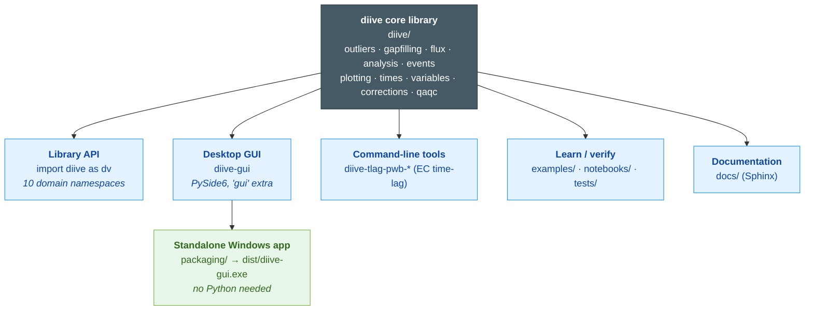

# diive — project overview

`diive` is one core library with several **surfaces** layered on top: ways to reach the
same processing code depending on who you are and what you're doing. This page maps
those surfaces so you know which folder, command, and audience each one belongs to.

For *how the code is organised internally* (modules, conventions), see
[`CLAUDE.md`](CLAUDE.md). For *how to contribute*, see [`CONTRIBUTING.md`](CONTRIBUTING.md).



## The surfaces

| Surface | Folder | How you reach it | Who it's for |
|---|---|---|---|
| **Library API** | `diive/` | `import diive as dv` | Scientists/devs scripting their own analysis |
| **Desktop GUI** | `diive/gui/` | `diive-gui` (`uv sync --extra gui`) | Interactive, no-code exploration |
| **Standalone exe** | `packaging/` | `build_gui.ps1` → `diive-gui.exe` | GUI users with no Python install |
| **CLI tools** | `diive/flux/hires/` | `diive-tlag-pwb-*` console scripts | High-res EC time-lag batch jobs |
| **Examples / notebooks / tests** | `examples/`, `notebooks/`, `tests/` | `uv run python …`, `pytest` | Learning the API; verifying changes |
| **Documentation** | `docs/` | Sphinx build (HTML) | Reference + guides |

### 1. Library API — the main way to use diive

`import diive as dv` exposes **10 domain namespaces** (`dv.outliers`, `dv.gapfilling`,
`dv.flux`, `dv.analysis`, `dv.plotting`, `dv.times`, `dv.variables`, `dv.corrections`,
`dv.qaqc`, `dv.events`) plus a handful of top-level I/O helpers. Everything else is built on this —
the GUI and CLIs are callers, not reimplementations. Start at the README
[Quick start](README.md#quick-start); the full namespace listing is in
[`CLAUDE.md`](CLAUDE.md).

### 2. Desktop GUI

A PySide6 desktop app (`diive/gui/`), shipped as an **optional** `gui` extra so headless
installs never pull in Qt.

```bash
uv sync --extra gui
diive-gui
```

Strict separation: the GUI only *calls* the library — all algorithms live in the core.
Developer map: [`diive/gui/README.md`](diive/gui/README.md). User manual:
[`diive/gui/MANUAL.md`](diive/gui/MANUAL.md).

### 3. Standalone Windows app (no Python for end users)

To hand the GUI to someone who has no Python/uv, build a one-folder Windows executable
with PyInstaller:

```powershell
uv sync --extra gui --group build
.\packaging\build_gui.ps1        # → dist\diive-gui\diive-gui.exe (+ a shareable zip)
```

Recipe and details: [`packaging/README.md`](packaging/README.md).

### 4. Command-line tools

Console scripts (declared in `pyproject.toml`) for high-resolution eddy-covariance
time-lag detection/removal — the **PWB** (pre-whitening bootstrap) workflow:

| Command | Does |
|---|---|
| `diive-tlag-pwb-batch` | Detect lags across many averaging-period files |
| `diive-tlag-apply-batch` | Apply detected lags to raw files |
| `diive-tlag-pwb-detect-remove` | Two-phase per-chunk detect + remove in one run |
| `diive-tlag-pwb-detect-remove-tui` | Textual TUI wrapping the above (`--demo` to preview) |

Code lives in `diive/flux/hires/`. See the **High-Resolution EC Analysis** section of
[`CLAUDE.md`](CLAUDE.md).

### 5. Examples, notebooks, and tests

- **`examples/`** — 113 runnable, API-only scripts in Sphinx-Gallery format (`# %%`
  cells, no file I/O). Run one with `uv run python examples/gapfilling/gapfill_randomforest.py`.
  Catalogued in `examples/CATALOG.md`. **Never run the whole suite** during development.
- **`notebooks/`** — exploratory Jupyter notebooks.
- **`tests/`** — unit/integration tests: `uv run pytest tests/ -v` (GUI tests need the
  `gui` extra and run offscreen).

### 6. Documentation (Sphinx)

Source in `docs/` (`conf.py`, `getting_started.rst`, `installation.rst`,
`api_reference.rst`, auto-generated API + gallery). Builds to HTML. This is the
long-term home for reference docs; the per-surface READMEs above are the working notes
that feed it.

## Repository layout (top level)

```
diive/        core library + gui/ + flux/hires/ CLIs   ← the engine and its surfaces
packaging/    PyInstaller build for the Windows exe
examples/     113 runnable API examples
notebooks/    exploratory Jupyter notebooks
tests/        unit + integration tests
docs/         Sphinx documentation source
README.md     front door (install, quick start, features)
CLAUDE.md     internal architecture + dev guide
CONTRIBUTING.md  how to contribute
CHANGELOG.md  version history
```
