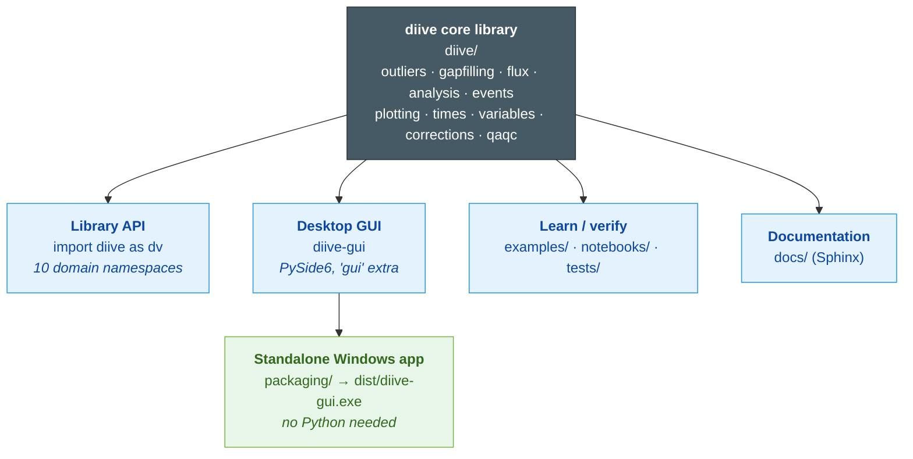

# diive — project overview

`diive` is one core library with several **surfaces** layered on top: ways to reach the
same processing code depending on who you are and what you're doing. This page maps
those surfaces so you know which folder, command, and audience each one belongs to.

For *how the code is organised internally* (modules, conventions), see
[`CLAUDE.md`](CLAUDE.md). For *how to contribute*, see [`CONTRIBUTING.md`](CONTRIBUTING.md).


```mermaid
flowchart TD
    core["<b>diive core library</b><br/>diive/<br/>outliers · gapfilling · flux · analysis · events<br/>plotting · times · variables · corrections · qaqc"]

    core --> lib["<b>Library API</b><br/>import diive as dv<br/><i>10 domain namespaces</i>"]
    core --> gui["<b>Desktop GUI</b><br/>diive-gui<br/><i>PySide6, 'gui' extra</i>"]
    core --> learn["<b>Learn / verify</b><br/>examples/ · notebooks/ · tests/"]
    core --> docs["<b>Documentation</b><br/>docs/ (Sphinx)"]

    gui --> exe["<b>Standalone Windows app</b><br/>packaging/ → dist/diive-gui.exe<br/><i>no Python needed</i>"]

    classDef root fill:#455A64,stroke:#263238,color:#fff;
    classDef surface fill:#E3F2FD,stroke:#2196F3,color:#0D47A1;
    classDef ship fill:#E8F5E9,stroke:#7CB342,color:#33691E;
    class core root;
    class lib,gui,learn,docs surface;
    class exe ship;
```

## The surfaces

| Surface | Folder | How you reach it | Who it's for |
|---|---|---|---|
| **Library API** | `diive/` | `import diive as dv` | Scientists/devs scripting their own analysis |
| **Desktop GUI** | `diive/gui/` | `diive-gui` (`uv sync --extra gui`) | Interactive, no-code exploration |
| **Standalone exe** | `packaging/` | `build_gui.ps1` → `diive-gui.exe` | GUI users with no Python install |
| **Examples / notebooks / tests** | `examples/`, `notebooks/`, `tests/` | `uv run python …`, `pytest` | Learning the API; verifying changes |
| **Documentation** | `docs/` | Sphinx build (HTML) | Reference + guides |

`diive` starts at averaged (e.g. 30-minute) data. Raw high-frequency (10/20 Hz) eddy
covariance tooling — wind rotation, flux detection limit, and the PWB time-lag CLIs —
moved to [dyco](https://github.com/holukas/dyco).

### 1. Library API — the main way to use diive

`import diive as dv` exposes **10 domain namespaces** (`dv.outliers`, `dv.gapfilling`,
`dv.flux`, `dv.analysis`, `dv.plotting`, `dv.times`, `dv.variables`, `dv.corrections`,
`dv.qaqc`, `dv.events`) plus a handful of top-level I/O helpers. Everything else is built on this —
the GUI is a caller, not a reimplementation. Start at the README
[Quick start](README.md#quick-start); the full namespace listing is in
[`CLAUDE.md`](CLAUDE.md).

### 2. Desktop GUI

A PySide6 desktop app (`diive/gui/`), shipped as an **optional** `gui` extra so headless
installs never pull in Qt.

```bash
uv sync --extra gui
diive-gui
```

Strict separation: the GUI only *calls* the library — all algorithms live in the core.
Developer map: [`diive/gui/README.md`](diive/gui/README.md). User manual:
[`diive/gui/MANUAL.md`](diive/gui/MANUAL.md).

### 3. Standalone Windows app (no Python for end users)

To hand the GUI to someone who has no Python/uv, build a one-folder Windows executable
with PyInstaller:

```powershell
uv sync --extra gui --group build
.\packaging\build_gui.ps1        # → dist\diive-gui\diive-gui.exe (+ a shareable zip)
```

Recipe and details: [`packaging/README.md`](packaging/README.md).

### 4. Examples, notebooks, and tests

- **`examples/`** — 113 runnable, API-only scripts in Sphinx-Gallery format (`# %%`
  cells, no file I/O). Run one with `uv run python examples/gapfilling/gapfill_randomforest.py`.
  Catalogued in `examples/CATALOG.md`. **Never run the whole suite** during development.
- **`notebooks/`** — exploratory Jupyter notebooks.
- **`tests/`** — unit/integration tests: `uv run pytest tests/ -v` (GUI tests need the
  `gui` extra and run offscreen).

### 5. Documentation (Sphinx)

Source in `docs/` (`conf.py`, `getting_started.rst`, `installation.rst`,
`api_reference.rst`, auto-generated API + gallery). Builds to HTML. This is the
long-term home for reference docs; the per-surface READMEs above are the working notes
that feed it.

**The tree is stale — don't trust it yet.** Its code examples are written against the
flat pre-namespace API (`dv.Hampel`, `dv.RandomForestTS`), most of the symbols it names
no longer exist, `api_reference.rst` lists modules that were removed, the checked-in
generated trees predate the current `examples/`, `installation.rst` is wrong about the
Python version and the extras, and nothing in `docs/` mentions the desktop GUI. Reworking
it is deferred as its own separate project (recorded in `CODE_REVIEW_FINDINGS.md`) and is
not part of the code-review campaign. Note that a build executes every example:
`conf.py` runs sphinx-gallery with `plot_gallery: True` over all 113 scripts. Until the
rework, the READMEs and [`CLAUDE.md`](CLAUDE.md) are the accurate references.

## Repository layout (top level)

```
diive/        core library + gui/                     ← the engine and its surfaces
packaging/    PyInstaller build for the Windows exe
examples/     113 runnable API examples
notebooks/    exploratory Jupyter notebooks
tests/        unit + integration tests
docs/         Sphinx documentation source (stale, rework deferred)
README.md     front door (install, quick start, features)
CLAUDE.md     internal architecture + dev guide
CONTRIBUTING.md  how to contribute
CHANGELOG.md  version history
```
